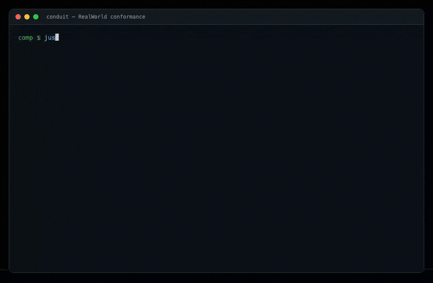

# conduit — the RealWorld spec, composed from capability contracts

A Medium-clone ("Conduit") — the [RealWorld](https://realworld-docs.netlify.app/)
reference app. Chosen for one reason the other showcases can't offer: it has an
**external, objective conformance suite**. The spec fixes the exact REST API
(down to JSON envelopes and status codes), and the project ships a conformance
suite (Hurl). "We composed it from contracts with no bespoke business crate"
stops being our claim and becomes something a skeptic clones and runs:
`just conformance-conduit` → all green.



Conduit is API-only (no bundled frontend — its proof is the conformance run
above, not a UI). Pattern mirrors `vet-domain` / `helpdesk-domain`: one **`conduit-domain`**
component that exports `wasi:http` and imports only WIT contracts. Every
capability behind it is a swappable reference implementation from the catalog.

## Why it's almost pure composition

Conduit is CRUD + auth + relations. Nearly every verb maps to a contract we
already ship; the gaps are honest, not glue.

## Product surface (two actors, one component)

| Actor | Surface | Auth |
|---|---|---|
| **Anonymous** | read articles/profiles/comments/tags, list & filter | none |
| **User** | register/login, edit profile, write/edit/delete articles, comment, favorite, follow | `Authorization: Token <jwt>` |

No roles, no admin, no tenants — every user is equal. So **no `rbac`, no
`policy-guard`, no multi-tenancy**; that's the whole access model.

## Spec gotchas (these are what conformance actually checks)

- **Auth header is `Token <jwt>`**, not `Bearer`. The domain component accepts both.
- **Envelope-wrapped** everything: `{"user":…}`, `{"article":…}`,
  `{"articles":[…],"articlesCount":N}`, `{"profile":…}`, `{"comment":…}`,
  `{"tags":[…]}`. Request bodies are wrapped too (`{"user":{…}}`).
- **Identity is the `username`**, not email. Register takes username+email+password;
  login is email+password; profiles and authorship key on username.
- **Listing is offset/limit**, not cursor. See the map — this is where a
  contract does *not* fit.
- `article.body` is raw Markdown; **the RealWorld frontend renders it**. So the
  API returns raw text — `md:render` is *not* on the conformance path.

## Domain model (all in `records:store`, keys as noted)

- **user** — `{username, email, subject, bio, image}`, indexed by `username`
  and `email`. `subject` is the auth-guard principal; username↔subject is a
  record lookup (auth-guard keys on email, Conduit keys on username).
- **article** — `{slug, title, description, body, tagList, author}`, indexed by
  `slug`, `author`, and each tag.
- **comment** — `{article, author, body}`, indexed by `article`.
- **follow** — relation record `{follower, followee}`, indexed both ways.
- **favorite** — relation record `{user, article}`, indexed both ways;
  `favoritesCount` = `count`, `favorited` = relation exists.

## The endpoints and what they compose

Full RealWorld API. `†` = auth required, `~` = auth optional (changes output).

```
POST   /api/users             register   {user:{username,email,password}}
POST   /api/users/login       login      {user:{email,password}}
GET  † /api/user              current user
PUT  † /api/user              update      {user:{email,username,password?,bio?,image?}}

GET  ~ /api/profiles/:username             + following flag
POST † /api/profiles/:username/follow
DEL  † /api/profiles/:username/follow

GET  ~ /api/articles          list; filters ?tag&author&favorited&limit&offset
GET  † /api/articles/feed     articles from followed authors ?limit&offset
GET  ~ /api/articles/:slug
POST † /api/articles          {article:{title,description,body,tagList}}
PUT  † /api/articles/:slug
DEL  † /api/articles/:slug
POST † /api/articles/:slug/favorite
DEL  † /api/articles/:slug/favorite

GET  ~ /api/articles/:slug/comments
POST † /api/articles/:slug/comments   {comment:{body}}
DEL  † /api/articles/:slug/comments/:id

GET    /api/tags
```

### Flows
- **Auth** (`accounts` register/login → `session`/`authorizer` introspect):
  register also writes the `user` record (username↔subject). Login is
  email+password — a clean match to auth-guard.
- **Article write** (`validate` payload → `slug:generate` from title, uniqueness
  suffix on collision → `id:generate` for comment ids → `records:store` with
  `author` + per-`tag` indexes). Update/delete are owner-only (author == caller,
  else 403).
- **List/filter/feed** — `records::find_by` on `tag` / `author`, then favorited
  by relation; **offset/limit sliced inline** (see gap below); enrich each with
  author profile + `favorited`/`favoritesCount`.
- **Profiles & follow** — `follow` relation records; `following` = does the
  relation exist for the caller.
- **Comments** — `records:store` indexed by article; the public id is an integer
  (stable hash of the record id, since RealWorld comment ids are integers);
  delete is author-only.
- **Favorites** — `favorite` relation; count + flag derived, no denormalized counter.
- **Tags** — union of every article's `tagList` (scan or a maintained tag set).

## Component map (as built)

**Reused as-is (3):** auth-guard (`accounts` + `authorizer` + `types`; **no
`rbac`, no `session`** — RealWorld has no roles and no logout), `record-store`,
`slug` (`slugify` + `uniquify` for article slugs). Plus one host WASI import:
`wasi:clocks/wall-clock` for millisecond `createdAt`/`updatedAt` (record:store
timestamps are second-only, and conformance asserts `updatedAt` *changes* after
an update).

**New components needed (1):**

| new | contract | why |
|---|---|---|
| `conduit-domain` | `conduit:app` exports `wasi:http` | the app itself |

**Deliberately NOT used (honest gaps, not oversights):**

| contract | why it doesn't apply |
|---|---|
| `paginate:cursor` | RealWorld is **offset/limit**; cursor pagination is a different contract. Sliced inline. *(add a `paginate:offset` variant later if we want the component to own it.)* |
| `md:render` | `article.body` is returned raw; the RealWorld **frontend** renders Markdown. Not on the conformance path. |
| `search-index` | filters are exact-match on tag/author/favorited via `find_by`, not full-text. Add later for a `?search=` extension beyond spec. |
| `validate` | payload checks are a handful of "can't be blank"/length guards inline — same choice `helpdesk-domain` made; a JSON-schema component would be more surface than the checks. |
| `id:generate` | `record:store` mints record ids; RealWorld comment ids must be **integers**, derived as a stable hash of the record id. |
| `rbac`, `policy-guard`, multi-tenancy | Conduit has no roles/tenants. |

That's the point: Conduit needs **one new component**. Everything else is the
catalog, and every gap (offset-vs-cursor, integer comment ids, second-resolution
timestamps) is stated, not hidden.

## Build order (each rung is demoable)

1. **Users & profiles** — register/login/current/update, follow/unfollow.
   ✅ done: `components/conduit-domain` + `just compose-conduit` +
   `just e2e-conduit` (Rust host + `examples/conduit` e2e, all green). Runs on
   the native Rust host (`host/`), not jco — the app, its host, and its test are
   all Rust; the only JS in this repo stays in the other examples.
2. **Articles** — CRUD, slug + uniqueness, list/feed with filters, tags.
   ✅ done: create/get/update/delete (author-only), `slugify`+`uniquify`,
   offset/limit list with tag/author/favorited filters, feed, `GET /api/tags`.
3. **Social** — comments (integer ids), favorites (counts + flags derived from
   relations). ✅ done.
4. **Conformance** — the **official RealWorld Hurl suite** (vendored in
   `examples/conduit/conformance/hurl`, pinned from `gothinkster/realworld`
   `specs/api`). ✅ **100% green — 13/13 files, 154 requests** via
   `just conformance-conduit` (Hurl → the composed app on the native Rust host).
   *(Upstream retired the Postman/newman suite for Hurl + Bruno; we track Hurl.)*
5. **Bench** — ✅ done: app-path HTTP bench (`bench/conduit-bench.sh`, memory vs
   NATS KV) → [`bench/CONDUIT-BENCH.md`](bench/CONDUIT-BENCH.md) (round 13).

## Known conformance caveats (flagged, not hidden)

- **Password update is accepted-but-not-rotated.** `PUT /api/user` validates the
  new password (NIST: reject null/""/<8, accept ≥8) and returns 200, but
  auth-guard has no "set password without the current one" verb, so the stored
  credential is unchanged. The suite checks the validation + status, never that
  the new password logs in. Wire a real rotation when auth-guard grows the verb.
- **Email change updates the display record, not the auth-guard login key.** Same
  reason; the suite never re-logs-in after a change.

## Non-goals (v1)

WebSockets/live updates (not in spec), full-text `?search`, email verification,
image upload for avatars (`image` is a URL string per spec), rate limiting
(spec doesn't test it — trivially added via `rate-limiter` as the helpdesk shows).
