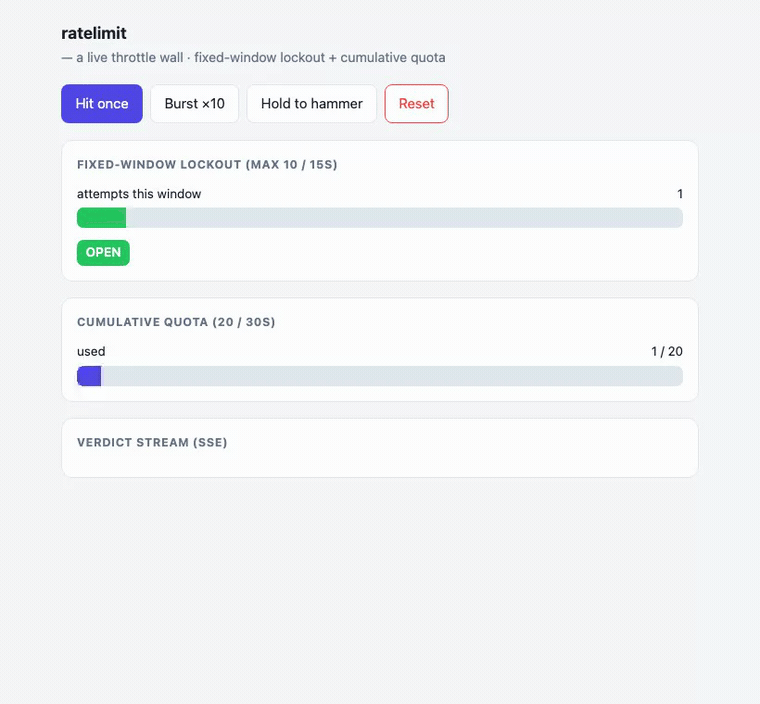

# ratelimit — a live throttle wall (lockout + quota, watched)

A live **throttle wall**: hammer an endpoint and watch the attempt counter climb
toward its ceiling, the key **lock out** with a countdown, then recover when the
window elapses — while a separate **quota meter** drains a cumulative budget that
only resets on its period. Chosen because it's the one axis none of the other
showcases touch: **backpressure you can see** — traffic shaping, lockout, and
budget enforcement as a live gauge, not a silent 429.

Same shape as the other showcases: one **`throttle-domain`** HTTP component that
exports `wasi:http` and imports only WIT contracts. Two complementary limiters,
both already in the catalog:

- **`ratelimit:guard`** — a fixed-window attempt counter with **lockout**: N
  strikes inside the window and the key is locked until the window elapses
  (the login-abuse / brute-force shape).
- **`quota:meter`** — a **cumulative budget**: used / remaining / resets-at over
  a period (the API-plan / spend-cap shape).



## Why it's almost pure composition

| throttle concern | contract | how |
|---|---|---|
| attempts-per-window + lockout | `ratelimit:guard` | `check(key)` returns attempts-left or `err(locked(retry-after))`; `record-failure(key)` strikes; `reset(key)` clears |
| cumulative budget + reset period | `quota:meter` | `record-usage(subject, 1, limit, period)` returns a `balance{used, remaining, resets-at}` |
| each decision fans out to every open wall | `event:bus` | one stream: `allow` / `strike` / `locked` / `quota` / `reset` |
| live push to the browser | **SSE** (same as pulse) | `GET /api/stream` holds open, writes each decision as a `data:` frame |
| request ids, timestamps | `id:generate`, `wasi:clocks` | decision ids, retry-after math |

The domain logic is a thin decision gate — on each hit, `check` the limiter and
`record-usage` on the meter, publish the verdict, return 200 or 429. Both
limiters are the contracts; the wall just calls them and streams the result.

## The new axis

The others show *state changing* (a message posted, an event delivered, a flag
flipped). This one shows **flow being shaped**: the attempt bar filling, the
lockout latch tripping with a live countdown, the quota gauge draining and
refilling on its period. The headline is the **429 you can watch coming** — the
gap between "allowed" and "throttled" made visible, and the two independent
limiter styles (windowed lockout vs cumulative budget) side by side.

## Product surface (one component, anonymous)

```
POST /api/hit          {key?, subject?}      one request through the wall → allow | throttled
POST /api/burst        {key?, n?}            fire N hits (demo convenience)
POST /api/fail         {key?}                record a failure (drives lockout)
POST /api/reset        {key?}                clear the limiter + meter for a key
GET  /api/state        ?key=&subject=        attempts-left, locked?, retry-after, quota balance
GET  /api/stream       ?key=                 LIVE SSE stream of decisions (text/event-stream)
GET  /                                       usage
```

All routes under `/api/…` so the static-dir SPA fallback doesn't shadow
`GET /api/stream` (same rule as pulse/pipeline/flags).

## Domain model

No durable state of its own — the limiter state lives in `ratelimit:guard` (kv:
window-start + counter per key) and `quota:meter` (kv: cumulative usage per
subject). The domain only *drives* them and publishes each verdict on
`event:bus`; the SSE cursor is a monotonic `seq` on the bus (same trick as
pulse). Window size / attempt ceiling / quota limit + period come from
`wasi:config` (`max-attempts`, `lockout-window`, and the meter's `limit` /
`period-seconds` passed per call), so a deploy tunes the wall without a rebuild.

## Component map

**Reused as-is (4):** `ratelimit:guard` (windowed lockout), `quota:meter`
(cumulative budget), `event:bus` (fan-out + SSE cursor), `id:generate` (decision
ids). Plus host WASI: `wasi:clocks/{wall-clock,monotonic-clock}` (retry-after +
the SSE sleep) and `wasi:io` (the SSE response stream).

**New (1):** `throttle-domain` — `throttle:app` exports `wasi:http`. The decision
gate + the SSE loop.

**Not used:** `auth-guard` (the wall is keyed by an arbitrary `key`/`subject`,
not a session — in production it sits *in front of* auth, throttling login
attempts before they cost a password hash).

## Build order (each rung is demoable)

1. **Gate + state** — `POST /api/hit` (check + record-usage), `GET /api/state`.
   `just e2e-ratelimit` proves N allowed then a 429 at the ceiling, and a quota
   `remaining` that decrements.
2. **Lockout + recovery + live SSE** — `record-failure` drives lockout; a locked
   key returns `retry-after`; `GET /api/stream` pushes each verdict. e2e: a
   burst locks the key, a reader sees the `locked` frame live, and the key
   recovers after the window.
3. **Wall UI** — a burst button + a hammer-hold, an attempt bar to the ceiling,
   a LOCKED latch with a live countdown, and a quota gauge draining/refilling.
   Served via `--static-dir`; `just host-ratelimit`, hold the button, watch it
   trip.
4. **Bench** — the backpressure dimension: decision latency under a sustained
   hammer, and correctness (exactly `ceiling` allowed before the first 429; the
   quota never goes negative under concurrent hits). See
   `bench/RATELIMIT-BENCH.md`.

## Non-goals (v1)

Token-bucket / leaky-bucket smoothing (the contract is fixed-window, which is
what most apps actually ship for abuse control), distributed rate limiting
across hosts (the kv backend makes it *possible* — a shared NATS/redis store —
but the demo runs one host), and per-route policy tables (one wall, one key; a
policy table is `config:store` + `proxy:route`, shown elsewhere).
