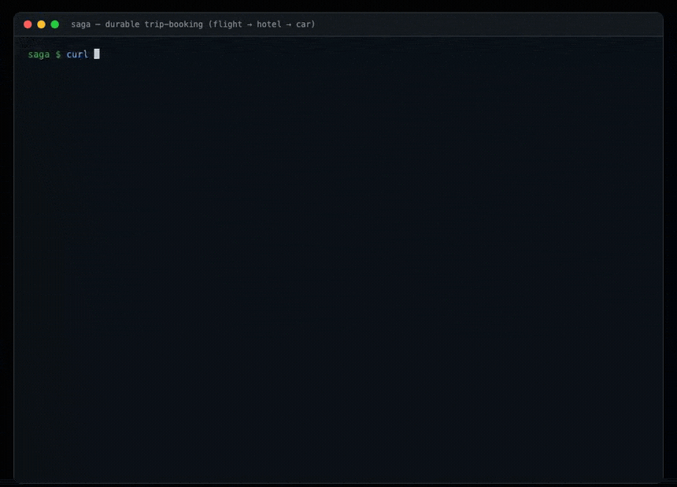

# saga — a durable trip-booking saga, composed from capability contracts

The textbook distributed **saga**: book a flight, then a hotel, then a car — and
if any leg fails, **compensate** the legs already booked, in reverse. Chosen
because its signature is the one axis none of the other showcases exercise:
**compensation + durable, resumable execution + retries/timeouts**. eShop does
forward choreography; a saga must also *roll back*, survive a crash mid-flight,
and retry a flaky step before giving up.

Pattern mirrors `vet-domain` / `conduit-domain`: one **`saga-domain`** component
that exports `wasi:http` and imports only WIT contracts. The saga *pattern* is
demonstrated by composing the durable primitives already in the catalog — no
bespoke engine, no business crate.



## Why it's almost pure composition

Every hard part of a saga already has a contract:

| saga concern | contract | how |
|---|---|---|
| durable state (which legs booked, what to undo) | `records:store` | one `saga` record + per-leg booking records; NATS-backed = survives restart |
| the lifecycle (running → committed / compensating → compensated) | `fsm:workflow` | a declarative machine; illegal jumps rejected, history recorded |
| each step / compensation runs **once** | `idempotency:guard` | key `saga:{id}:book:{leg}` / `:comp:{leg}` — a retried pump never double-books |
| retry a flaky leg, then give up | `sched:timer` + attempt cap | a transient failure arms a retry timer + bumps the step's `attempts`; after the ceiling → give up → compensate |
| step events (booked / failed / retry / compensated) | `event:bus` | one stream; nothing calls a side effect directly |
| ids, timestamps | `id:generate`, `wasi:clocks` | booking refs (`FL-…`), `startedAt`, per-leg timestamps |

*(`outbox:dispatch` is the natural transport once a leg calls a **real remote
service** — at-least-once delivery + a dead-letter queue. Here the legs are
in-process simulated bookings, so the retry ceiling + timer are enough and
honest; the outbox dep is wired for that upgrade.)*

## Product surface (one component, anonymous)

No auth — a saga engine is driven by trip id, like a workflow runner. (Auth is
orthogonal and shown elsewhere; keeping it out keeps the focus on the pattern.)

```
POST /trips            {traveler, failLeg?}   start a saga (legs: flight,hotel,car)
GET  /trips/{id}       saga status + step timeline + fsm history
POST /trips/{id}/run   drive to a terminal state (book in order; compensate on failure)
POST /internal/pump    advance every running saga one step (timers/retries/resume)
GET  /                 usage
```

`failLeg` (e.g. `"car"`) makes that leg's booking fail deterministically, so the
demo can show both the committed path and the compensating path on demand.

## Domain model (`records:store`)

- **saga** — `{id, traveler, status, cursor, steps:[{leg, state, ref, price, at}], failLeg}`,
  indexed by `status` (so the pump finds running sagas). `state` per leg:
  `pending → booked → compensated` (or `failed`).
- **booking** — one per booked leg `{saga, leg, ref, price}`; compensation deletes it.
- fsm machine **saga**: `running → committed` (all legs booked, terminal);
  `running → compensating → compensated` (terminal); `running → failed` (terminal).

## The flows

1. **Start** (`POST /trips`) — mint a saga id (`id:generate`), write the `saga`
   record with three `pending` legs, `fsm:create-instance` in `running`, publish
   `saga.started`.
2. **Book a leg** — idempotency-guarded (`saga:{id}:book:{leg}`): reserve →
   `booking` record + mark the leg `booked`, publish `saga.leg.booked`. On
   success advance the cursor; when all three are booked, `fsm.fire("commit")`
   → **committed**, publish `saga.committed`.
3. **Compensate** — a leg fails → `fsm.fire("fail")` → **compensating** → for
   each already-`booked` leg in reverse, idempotency-guarded
   (`saga:{id}:comp:{leg}`): cancel the `booking`, mark `compensated`, publish
   `saga.leg.compensated` → `fsm.fire("compensated")` → **compensated**.
4. **Retry** (rung 3) — a *flaky* leg (`flakyLeg` + `flakyFails`) fails
   transiently; each failure bumps the step's `attempts` and arms a
   `sched:timer` retry. It recovers and commits, or — past the retry ceiling —
   **gives up and compensates**.
5. **Durability** (rung 3) — all state is in `records:store` + `fsm` (both
   KV-backed). Kill the host mid-saga, restart, `POST /internal/pump` → the saga
   resumes exactly where it left off. Nothing is held in component memory.
   (`just durable-saga` proves it end to end.)

## Component map

**Reused as-is (6):** `record-store`, `fsm-workflow`, `idempotency-guard`,
`scheduler-timer`, `event-bus`, `id-generate`. Plus host WASI
`wasi:clocks/wall-clock`. (`outbox` is wired as a dep for the real-remote-leg
upgrade; leg prices are inline cents, so `money` isn't pulled in.)

**New (1):** `saga-domain` — `saga:app` exports `wasi:http`. The orchestrator.

**Not used:** `auth-guard`/`rbac` (anonymous engine), `slug`/`search`/`md` (no
content). A *generic* `saga:orchestrator` contract (arbitrary step + compensation
definitions, like `fsm:workflow` is generic) is the natural next extraction —
this app encodes one concrete saga first, the way `vet-domain` predated pulling
capabilities into contracts.

## Build order (each rung is demoable)

1. ✅ **Happy path** — start → flight → hotel → car → committed; durable state,
   fsm status + history, step events. (`saga-domain` + fsm + records + idempotency
   + event-bus, `just e2e-saga`.)
2. ✅ **Compensation** — `failLeg` fails a leg → compensate booked legs in
   reverse; idempotency proves each undo runs once. e2e asserts the rollback and
   the first-leg-fails (nothing to undo) case.
3. ✅ **Durability + retries** — a flaky leg retries via `sched:timer` and either
   recovers or (past the ceiling) compensates; `pump` advances one persisted step
   at a time; the saga **survives a host kill and resumes** on NATS
   (`just durable-saga` → PASS).
4. ✅ **Bench** — app-path round, memory vs NATS: the first bench of a *stateful
   workflow* path. See [`bench/SAGA-BENCH.md`](bench/SAGA-BENCH.md).
5. ✅ **Golem-backed legs** — a leg is booked by invoking a real durable
   [Golem](GOLEM.md) worker over `wasi:http/outgoing-handler` (the same worker the
   `golem-workflow` provider bridges to). Send a trip with `golemUrl` + `golemHost`
   and each leg becomes a crash-proof workflow while the saga still owns
   compensation. Live proof: `just saga-golem` → the saga commits with
   golem-issued refs (`FL-golem-1`) and the leg's durable worker state advances.

### Golem-backed legs — how the hop works

Set `golemUrl` (e.g. `http://127.0.0.1:9006`) and `golemHost` (the gateway
subdomain, e.g. `golem-agent.localhost:9006`) on `POST /trips`. Each leg then
does a fenced `POST {golemUrl}/counters/{leg}-{saga}/increment` to a durable
worker; a `2xx` yields the golem ref, anything else rolls the saga back through
its normal compensation. The leg is still idempotency-guarded, so a retried pump
never double-invokes the worker. Omit the fields and legs stay simulated —
same code path, no infra needed.

> **wasi:http gotcha:** the outbound `Host` header is derived from the request
> *authority*, not a manual `host` field, and Golem's gateway routes by
> subdomain Host. So the authority must be the gateway host itself
> (`golem-agent.localhost:9006`, which resolves to loopback locally) — not the
> raw `127.0.0.1`. Getting this wrong is a silent `404` from the gateway.

## Non-goals (v1)

A generic saga-definition contract (this app is one concrete saga), parallel
legs (strictly sequential here), and human-approval steps. Legs are simulated
bookings by default so failure is deterministic and the demo is self-contained;
rung 5 upgrades a leg to a **real** durable Golem worker when infra is present.
