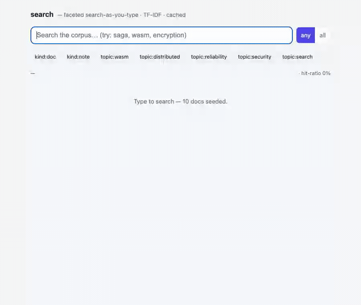

# search — faceted search-as-you-type over a real corpus

A live **search box**: type, and ranked results narrow with every keystroke;
click a **facet** and the result set filters; a **cache** short-circuits repeat
queries and the hit-ratio is visible. Chosen because it's the one axis none of
the other showcases touch: every showcase so far is **write- or stream-shaped**
(post, enqueue, assign, flip); this one is **read/query-shaped** — a relevance-
ranked lookup over a corpus, measured by latency and cache hit-rate.

Same shape as the other showcases: one **`search-domain`** HTTP component that
exports `wasi:http` and imports only WIT contracts. The search *engine* is the
`search:index` contract (TF-IDF over a KV-backed inverted index) — no
Elasticsearch, no network, no bespoke ranking.



## Why it's almost pure composition

| search concern | contract | how |
|---|---|---|
| the inverted index + TF-IDF ranking | `search:index` | `index-doc(id, text, tags)` / `query(text, mode, tags, limit)` → ranked `hit{id, score}` |
| the documents themselves (title, body, url) | `records:store` | the corpus lives here; the index holds only postings, so a hit's `id` fetches the full record |
| repeat-query short-circuit + hit-ratio | `cache:store` | `get-through` / `put-through` on the query key; `invalidate-prefix` on re-index; the ratio is the read-path story |
| opaque "load more" paging over ranked hits | `paginate:cursor` | signed cursor over the ranked id list — deep paging without leaking offsets |
| corpus seeding + ids | `id:generate` | document ids for the seed corpus |

The domain logic is a thin query pipeline — tokenize the box, hit the cache,
miss → `search:index/query` → hydrate ids from `records:store` → page → cache
the result. Everything hard (tokenizing, postings, TF-IDF) is the contract.

## The new axis

The others are measured by *did the write land / did the event arrive*. Search
is measured by **relevance + latency**:

- **relevance** — TF-IDF means a rare term outranks a common one; typing a
  second term (in `all` mode) *intersects*, shrinking the set; facets filter by
  exact tag. You can watch the ranking reorder as the query sharpens.
- **latency + cache** — the same query typed twice is a cache hit; the console
  shows a running **hit-ratio** and per-query millis. This is the only showcase
  whose headline number is a *read* metric, and the bench round (rung 4) is
  query percentiles under a warm vs cold cache.

## Product surface (one component, anonymous)

```
GET  /api/search        ?q=&mode=&tags=&limit=&cursor=   ranked hits (hydrated) + page-info + timing + cache-hit
GET  /api/doc/{id}                                        one full document
POST /api/index         {id?, title, body, tags}          index (or re-index) a document
POST /api/seed                                            load the demo corpus (idempotent)
GET  /api/stats                                           doc-count + cache hit-ratio
GET  /                                                    usage
```

All routes under `/api/…` so the static-dir SPA fallback doesn't shadow them
(same rule as pulse/pipeline/flags/abtest). No SSE here — search is
request/response; the *new* thing is the read/query path, not a stream.

## Domain model (`records:store`)

- **document** — `{id, title, body, url, tags[], at}`, indexed into
  `search:index` as `text = title + " " + body` with `tags` as facets. The
  record store holds the full doc; the index holds only postings keyed by the
  same `id`. Re-indexing an id replaces its postings and invalidates the query
  cache prefix.

## Component map

**Reused as-is (5):** `search:index` (the engine), `records:store` (the corpus),
`cache:store` (query cache + hit-ratio), `paginate:cursor` (load-more), and
`id:generate` (seed ids). Plus host WASI: `wasi:clocks/wall-clock` (timing +
`at`). No `wasi:io` streaming — no SSE.

**New (1):** `search-domain` — `search:app` exports `wasi:http`. The query
pipeline (cache → index → hydrate → page) + the corpus/index write path.

**Not used:** `auth-guard` (anonymous search box; scoping by tenant is a `tags`
facet, not auth), and anything stream/SSE (this is the request/response one).

## Build order (each rung is demoable)

1. **Index + query** — `POST /api/index`, `POST /api/seed`, `GET /api/search`
   (index → hydrate). `just e2e-search` seeds the corpus and asserts a rare term
   ranks its doc first and `all`-mode intersection shrinks the set.
2. **Facets + paging** — `tags` filter + `paginate:cursor` load-more; e2e proves
   a facet restricts hits and the cursor walks ranked pages without overlap.
3. **Cache + hit-ratio + browser UI** — `cache:store` around the query; a
   search-as-you-type SPA (debounced box, live ranked list, facet chips, a
   hit-ratio meter). `just host-search`, type and watch it rank + the ratio
   climb.
4. **Bench** — the read-path dimension: query **latency percentiles** cold vs
   warm cache, and ranking correctness (a known query returns the known doc
   first) across a larger seeded corpus. See `bench/SEARCH-BENCH.md`.

## Non-goals (v1)

Stemming / fuzzy / typo-tolerance (the tokenizer is ASCII-fold + lowercase +
split — deliberately minimal, per the `search:index` contract), phrase/proximity
queries, and relevance tuning knobs (BM25, field boosts) — the contract is
TF-IDF top-k, and the showcase demonstrates *composition*, not a search-quality
research project.
