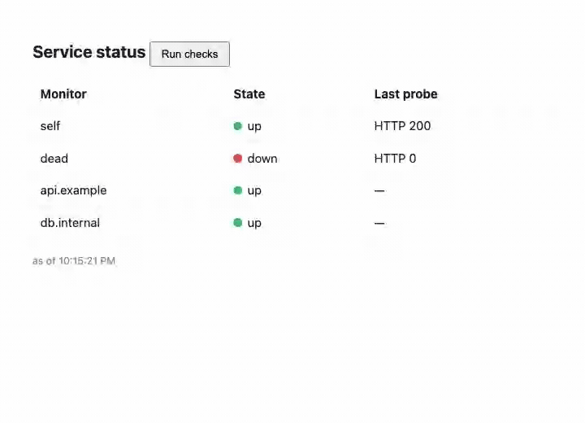

# status — a status page / uptime monitor

A **status page**: register monitors (a URL + a check period), and each one is a
recurring **timer job** that probes its target and drives an up → degraded →
down state machine — one failure degrades, a **second consecutive** failure
takes it down, one good probe recovers. A transition fans out on an event bus
and, if the monitor has an alert URL, fires a webhook. Chosen because it's the
one axis none of the other showcases touch: the workload **originates from a
timer, not an inbound request** — the HTTP surface is just how you configure it
and read it back.

Same shape as the other showcases: one **`status-page`** HTTP component that
exports `wasi:http` and imports only WIT contracts. The recurring jobs are
`sched:timer`, the per-monitor state machine is `fsm:workflow`, the probes go
out over `wasi:http/outgoing-handler` — no cron, no bespoke scheduler, no
hand-rolled state transitions.



## Why it's almost pure composition

| status concern | contract | how |
|---|---|---|
| one recurring check per monitor | `sched:timer` | each monitor is a timer job with a period; `POST /api/tick` claims the due ones (wasip2 has no background tasks — the tick is the explicit pump) |
| monitor config + last-probe snapshot | `records:store` | url, period, alert-url, last status/ok |
| up / degraded / down per monitor + history | `fsm:workflow` | an fsm instance per monitor; the transition log **is** the history — down needs two consecutive `fail`s, one `ok` recovers |
| state-change fan-out | `event:bus` | a transition publishes to the bus; `GET /api/events` is a consumer-group poll |
| alert on state change | `notify:dispatch` | when a monitor has an `alert-url`, a transition fires a webhook |

The domain logic is a thin loop — claim due jobs, probe each over outgoing HTTP,
feed `ok`/`fail` to the fsm, publish + alert on transition. Everything hard
(due/lease scheduling, the state machine, consumer-group delivery) is the
contract.

## The new axis

The others are driven by a request or a stream from a client. Status is driven
by **the clock**:

- **timer-originated** — the unit of work is a *scheduled job*, not a request.
  `POST /api/tick` is the pump (wasip2 has no background threads), but what it
  runs is due-timer logic from `sched:timer` — the same primitive a cron or a
  retry-backoff would use.
- **stateful health** — a single failed probe is **degraded**, not down; only a
  second consecutive failure is **down**; a good probe recovers. That
  hysteresis is an `fsm:workflow` state machine, and its transition log is the
  incident history. This is the only showcase whose headline is *a background
  job driving a state machine*.

## Product surface (one component)

```
GET    /                              status page (inline html)
POST   /api/monitors                  {name, url, period?, alert-url?}
GET    /api/monitors                  list monitors
DELETE /api/monitors/{id}             remove a monitor
GET    /api/status                    monitors + fsm state + last probe
GET    /api/monitors/{id}/history     fsm transition log
POST   /api/tick                      claim due jobs, probe, transition
GET    /api/events    ?group&ack      event-bus consumer poll
```

The page is served inline at `/`; all data routes under `/api/…`. No SSE — the
page polls `/api/status` and the tick is an explicit POST.

## Domain model

- **monitor** (`records:store`) — `{id, name, url, period, alert_url?,
  last_checked, last_ok, last_status}`. Period has a 10s floor.
- **health** (`fsm:workflow`) — one instance per monitor over states
  `up | degraded | down`. Events: `ok` (→ up), `fail` (up → degraded → down).
  The instance's transition log is `/api/monitors/{id}/history`.

## Component map

**Reused as-is (5):** `sched:timer` (the recurring jobs), `records:store`
(monitor config), `fsm:workflow` (per-monitor health + history), `event:bus`
(transition fan-out), `notify:dispatch` (alert webhooks). Plus host WASI:
`wasi:http/outgoing-handler` (the probes) + `wasi:clocks/wall-clock` (due/now).
This is the read/monitor-side user of both `sched:timer` and `fsm:workflow`.

**New (0):** `status-page` (`status:app`) already existed in the catalog — this
showcase is its design doc, e2e, and demo, not a new component.

**Not used:** `auth-guard` (the demo page is open), and anything SSE (the page
polls; the tick is an explicit pump).

## Build order (each rung is demoable)

1. **Register + probe** — `POST /api/monitors`, `POST /api/tick` over
   `sched:timer` + outgoing HTTP. `just e2e-status` adds a self-probe (stays up)
   and a dead-port monitor and asserts the first tick probes both.
2. **State machine + history** — feed `ok`/`fail` to `fsm:workflow`; e2e proves
   one failure is **degraded**, a second consecutive failure is **down**, and
   both hops are in the transition log.
3. **Fan-out + alerts + page** — `event:bus` transition events + a
   `notify:dispatch` webhook when `alert-url` is set; the inline page shows the
   monitor table + a "Run checks" button. `just host-status`, add a monitor and
   run checks.
4. **Bench** — the timer dimension: ticks/sec claiming N due jobs, and probe
   fan-out latency. See `bench/HOST-PERF.md` (round 11 already benches
   status-page alongside relay + ledger).

## Non-goals (v1)

A real scheduler daemon (the tick is an explicit POST — wasip2 has no background
tasks), probe methods beyond a GET + status-code check (no body assertions, no
TLS-cert expiry), and multi-region probing. The showcase demonstrates the
**timer-driven composition**, not a production uptime service.
