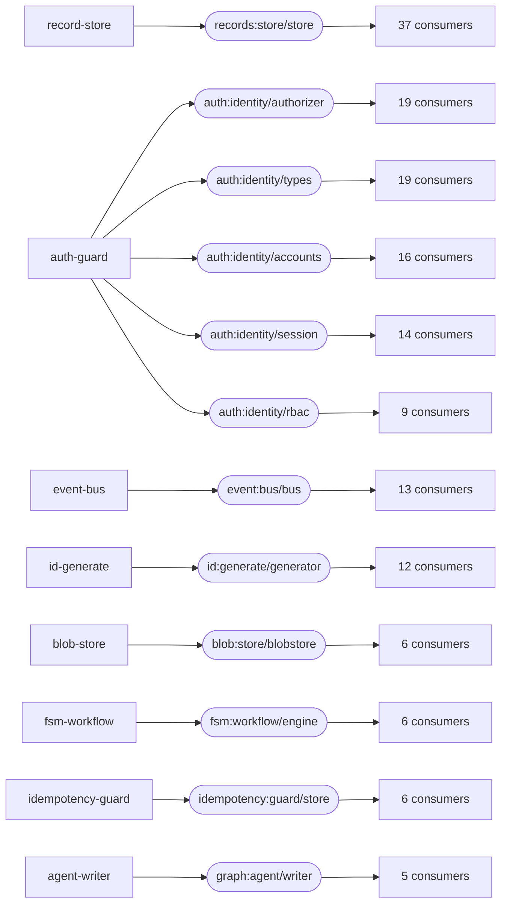

# The capability graph

Generated by `comp-capgraph` — do not edit by hand. Regenerate with `just capgraph`.

Derived from the BUILT artifacts, not from `components/*/wit/` and not from the
`Justfile`. A component's real imports are in its binary — the compiler drops
the ones nothing calls — so this cannot drift from what the components
actually do, the way a hand-maintained dependency list does.

**150 components, 80 interfaces with a provider and at least one consumer, 300 import edges, 13 interfaces exported but unconsumed in-tree.**

## Can I change this interface?

The number in the first column is the answer. One consumer means an edit; thirty-seven means a migration, and no gate in this repository runs those thirty-seven apps. An interface with many consumers is frozen in practice whatever its version number says, and extending it means a NEW interface or a new version with both live — see [ADR-0089](adr/0089-capability-accumulation.md).

| consumers | interface | provider | who imports it |
| --: | --- | --- | --- |
| 37 | `records:store/store` | `record-store` | `arena-domain`, `billing-ledger`, `booked-domain`, `books-domain`, `buzz-domain`, `clinic-domain`, `conduit-domain`, `csv-report`, `dashboards-domain`, `dev-portal`, `eshop-basket`, `eshop-catalog`, `eshop-ordering`, `gate-domain`, `helpdesk-domain`, `jobs-domain`, `link-shortener`, `lms-domain`, `mesh-domain`, `mfa-authgate`, `passkey-domain`, `paste-bin`, `payees-domain`, `platform-domain`, `pulse-domain`, `saga-domain`, `scribe-domain`, `search-domain`, `stash-domain`, `status-page`, `studio-domain`, `tempo-domain`, `track-domain`, `transit-domain`, `upload-drop`, `vet-domain`, `webhook-relay` |
| 19 | `auth:identity/authorizer` | `auth-guard` | `accounts-app`, `booked-domain`, `books-domain`, `buzz-domain`, `conduit-domain`, `dashboards-domain`, `dev-portal`, `eshop-basket`, `eshop-ordering`, `helpdesk-domain`, `lms-domain`, `payees-domain`, `platform-domain`, `sample-consumer`, `stash-domain`, `tempo-domain`, `track-domain`, `transit-domain`, `vet-domain` |
| 19 | `auth:identity/types` | `auth-guard` | `accounts-app`, `booked-domain`, `books-domain`, `buzz-domain`, `conduit-domain`, `dashboards-domain`, `dev-portal`, `eshop-basket`, `eshop-ordering`, `helpdesk-domain`, `lms-domain`, `payees-domain`, `platform-domain`, `sample-consumer`, `stash-domain`, `tempo-domain`, `track-domain`, `transit-domain`, `vet-domain` |
| 16 | `auth:identity/accounts` | `auth-guard` | `accounts-app`, `booked-domain`, `books-domain`, `buzz-domain`, `conduit-domain`, `dashboards-domain`, `dev-portal`, `helpdesk-domain`, `lms-domain`, `payees-domain`, `platform-domain`, `stash-domain`, `tempo-domain`, `track-domain`, `transit-domain`, `vet-domain` |
| 14 | `auth:identity/session` | `auth-guard` | `accounts-app`, `booked-domain`, `books-domain`, `buzz-domain`, `dashboards-domain`, `dev-portal`, `helpdesk-domain`, `lms-domain`, `payees-domain`, `stash-domain`, `tempo-domain`, `track-domain`, `transit-domain`, `vet-domain` |
| 13 | `event:bus/bus` | `event-bus` | `abtest-domain`, `eshop-basket`, `eshop-catalog`, `eshop-ordering`, `eshop-payment`, `flags-domain`, `pipeline-domain`, `pulse-domain`, `saga-domain`, `status-page`, `throttle-domain`, `track-domain`, `vet-domain` |
| 12 | `id:generate/generator` | `id-generate` | `abtest-domain`, `arena-domain`, `clinic-domain`, `dev-portal`, `flags-domain`, `helpdesk-domain`, `link-shortener`, `pipeline-domain`, `pulse-domain`, `saga-domain`, `scribe-domain`, `throttle-domain` |
| 9 | `auth:identity/rbac` | `auth-guard` | `accounts-app`, `booked-domain`, `dev-portal`, `helpdesk-domain`, `lms-domain`, `tempo-domain`, `track-domain`, `transit-domain`, `vet-domain` |
| 6 | `blob:store/blobstore` | `blob-store` | `artifact-cache`, `platform-domain`, `studio-domain`, `upload-drop`, `vet-domain`, `virt-git` |
| 6 | `fsm:workflow/engine` | `fsm-workflow` | `eshop-ordering`, `helpdesk-domain`, `saga-domain`, `status-page`, `track-domain`, `vet-domain` |
| 6 | `idempotency:guard/store` | `idempotency-guard` | `billing-ledger`, `eshop-catalog`, `eshop-ordering`, `jobs-domain`, `saga-domain`, `webhook-ingest` |
| 5 | `graph:agent/writer` | `agent-writer` | `agent-driver`, `agent-probe`, `driver-probe`, `graph-selector`, `select-probe` |
| 5 | `outbox:dispatch/queue` | `outbox` | `billing-ledger`, `dev-portal`, `jobs-domain`, `pipeline-domain`, `webhook-relay` |
| 4 | `cache:store/cache` | `cache` | `link-shortener`, `passkey-domain`, `search-domain`, `vet-domain` |
| 4 | `csv:codec/codec` | `csv` | `billing-ledger`, `csv-report`, `stash-domain`, `vet-domain` |
| 4 | `llm:inference/inference` | `anthropic-provider` | `agent-writer`, `ai-inference`, `knowledge-memory`, `llm-probe` |
| 4 | `md:render/renderer` | `markdown` | `helpdesk-domain`, `paste-bin`, `track-domain`, `vet-domain` |
| 4 | `notify:dispatch/dispatcher` | `notify-dispatch` | `dev-portal`, `status-page`, `track-domain`, `webhook-relay` |
| 4 | `quota:meter/meter` | `quota` | `billing-ledger`, `dev-portal`, `platform-domain`, `throttle-domain` |
| 4 | `ratelimit:guard/limiter` | `rate-limiter` | `auth-guard`, `link-shortener`, `throttle-domain`, `webhook-relay` |
| 4 | `search:index/index` | `search-index` | `knowledge-memory`, `search-domain`, `track-domain`, `vet-domain` |
| 4 | `secrets:vault/vault` | `secrets-vault` | `login-app`, `mfa-authgate`, `platform-domain`, `vet-domain` |
| 4 | `slug:generate/generator` | `slug` | `conduit-domain`, `link-shortener`, `paste-bin`, `slug-probe` |
| 4 | `webhook:sign/signer` | `webhook-sign` | `dev-portal`, `track-domain`, `upload-drop`, `webhook-relay` |
| 3 | `git:forge/repo` | `github-forge` | `forge-probe`, `graph-selector`, `select-probe` |
| 3 | `graph:fitness/evaluator` | `checks-runner` | `agent-driver`, `driver-probe`, `fitness-probe` |
| 3 | `knowledge:graph/store` | `knowledge-graph` | `contract-registry`, `graph-probe`, `knowledge-memory` |
| 3 | `paginate:cursor/cursors` | `pagination` | `csv-report`, `track-domain`, `vet-domain` |
| 3 | `pdf:codec/codec` | `pdf` | `books-domain`, `lms-domain`, `tempo-domain` |
| 3 | `policy:guard/guard` | `policy-guard` | `dev-portal`, `platform-domain`, `track-domain` |
| 3 | `proxy:route/router` | `proxy-route` | `eshop-gateway`, `event-pusher`, `mesh-domain` |
| 3 | `sched:timer/timer` | `scheduler-timer` | `saga-domain`, `status-page`, `vet-domain` |
| 3 | `session:store/store` | `session-store` | `login-app`, `mfa-authgate`, `passkey-domain` |
| 3 | `validate:schema/validator` | `validate` | `csv-report`, `paste-bin`, `vet-domain` |
| 2 | `ai:inference/inference` | `ai-inference` | `track-domain`, `vet-domain` |
| 2 | `audit:log/recorder` | `audit-log` | `auth-guard`, `webhook-relay` |
| 2 | `lock:mutex/mutex` | `lock-mutex` | `booked-domain`, `vet-domain` |
| 2 | `metrics:collect/collector` | `metrics-collect` | `abtest-domain`, `search-domain` |
| 2 | `money:amount/arithmetic` | `money` | `billing-ledger`, `vet-domain` |
| 2 | `otp:totp/authenticator` | `otp` | `mfa-authgate`, `vet-domain` |
| 2 | `pii:redact/redactor` | `pii-redact` | `paste-bin`, `vet-domain` |
| 2 | `qr:encode/encoder` | `qr` | `mfa-authgate`, `transit-domain` |
| 2 | `svg:chart/charts` | `svg-chart` | `dashboards-domain`, `lms-domain` |
| 2 | `ui:assets/files` | `static-assets` | `track-domain`, `vet-domain` |
| 2 | `upload:policy/gate` | `upload-policy` | `upload-drop`, `vet-domain` |
| 2 | `wit:reflect/composer` | `wit-reflect` | `platform-domain`, `studio-domain` |
| 2 | `wit:reflect/inspector` | `wit-reflect` | `platform-domain`, `studio-domain` |
| 1 | `artifact:cache/store` | `artifact-cache` | `artifact-probe` |
| 1 | `audit:log/query` | `audit-log` | `webhook-relay` |
| 1 | `cache:store/sink` | `cache-backing` | `cache` |
| 1 | `cache:store/source` | `cache-backing` | `cache` |
| 1 | `config:store/store` | `config-store` | `login-app` |
| 1 | `contract:registry/registry` | `contract-registry` | `contract-probe` |
| 1 | `crdt:merge/merger` | `crdt` | `scribe-domain` |
| 1 | `cron:expr/parser` | `cron` | `jobs-domain` |
| 1 | `demo:shape/pager` | `demo` | `demo-probe` |
| 1 | `diff:text/differ` | `textdiff` | `scribe-domain` |
| 1 | `durable:workflow/orchestrator` | `golem-bridge` | `jobs-domain` |
| 1 | `email:template/renderer` | `email-render` | `booked-domain` |
| 1 | `experiment:assign/assigner` | `experiment-assign` | `abtest-domain` |
| 1 | `featureflags:guard/evaluator` | `feature-flags` | `flags-domain` |
| 1 | `graph:run/driver` | `agent-driver` | `driver-probe` |
| 1 | `graph:select/selector` | `graph-selector` | `select-probe` |
| 1 | `i18n:catalog/catalog` | `i18n-catalog` | `vet-domain` |
| 1 | `iban:validate/validator` | `iban` | `payees-domain` |
| 1 | `ical:codec/codec` | `ical` | `booked-domain` |
| 1 | `json:patch/patcher` | `jsonpatch` | `webhook-relay` |
| 1 | `knowledge:memory/memory` | `knowledge-memory` | `memory-probe` |
| 1 | `knowledge:memory/promotion` | `knowledge-memory` | `memory-probe` |
| 1 | `ledger:doubleentry/ledger` | `ledger` | `books-domain` |
| 1 | `quiz:grade/grader` | `quiz-grade` | `lms-domain` |
| 1 | `resilience:breaker/breaker` | `resilience` | `mesh-domain` |
| 1 | `rrule:recur/recur` | `rrule` | `booked-domain` |
| 1 | `shaper:limit/limiter` | `shaper` | `gate-domain` |
| 1 | `vgit:store/objects` | `virt-git` | `vgit-probe` |
| 1 | `vgit:store/refs` | `virt-git` | `vgit-probe` |
| 1 | `vgit:store/worktree` | `virt-git` | `vgit-probe` |
| 1 | `webauthn:verify/verifier` | `webauthn` | `passkey-domain` |
| 1 | `webhook:ingest/verifier` | `webhook-ingest` | `webhook-relay` |
| 1 | `zip:archive/archiver` | `zip` | `stash-domain` |

## The load-bearing few

## Exported, and nothing in this repository imports it

Not a finding. A capability library is allowed to be ahead of its callers, and several of these are providers meant to be swapped in at deploy time. It is here because "nobody depends on this yet" is exactly the window in which an interface can still be changed freely.

| component | interface |
| --- | --- |
| `abtest-domain` | `wasi:http/incoming-handler` |
| `auth-guard` | `auth:identity/jwt` |
| `auth-guard` | `auth:identity/oidc` |
| `bigadd` | `demo:bigadd/bignum` |
| `calc` | `demo:calc/arith` |
| `event-pusher` | `wasmcloud:messaging/handler` |
| `expr` | `demo:expr/language` |
| `geo` | `geo:resolve/coords` |
| `glob` | `demo:glob/matcher` |
| `login-app` | `login:app/auth` |
| `ordinal` | `demo:ordinal/suffix` |
| `roman` | `demo:roman/numerals` |
| `rot13` | `demo:rot13/cipher` |

