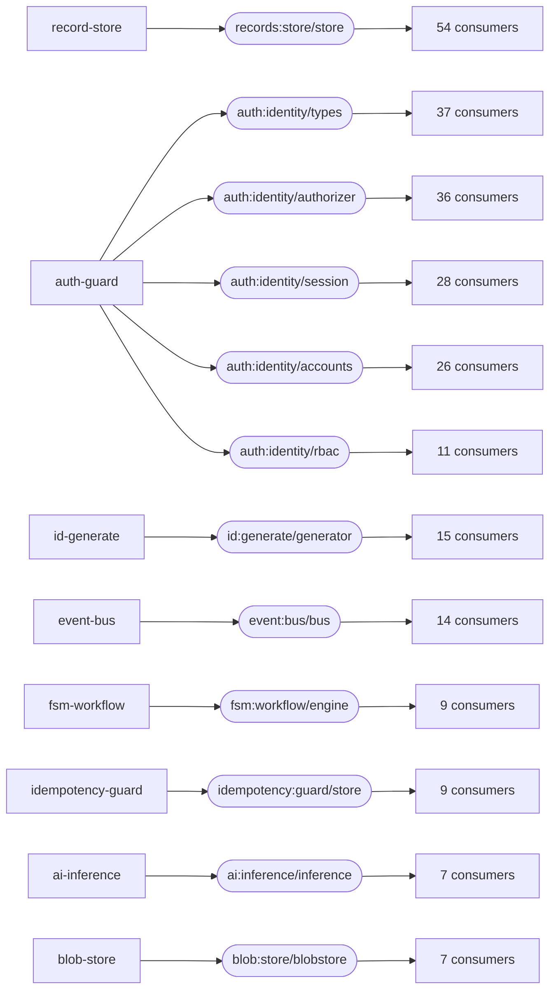
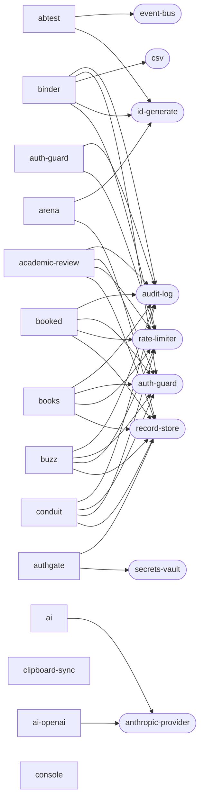

# The capability graph

Generated by `comp-capgraph` — do not edit by hand. Regenerate with `just capgraph`.

Derived from the BUILT artifacts, not from `components/*/wit/` and not from the
`Justfile`. A component's real imports are in its binary — the compiler drops
the ones nothing calls — so this cannot drift from what the components
actually do, the way a hand-maintained dependency list does.

Three layers: an INTERFACE is provided by one component and imported by several; a COMPONENT is composed into one or more applications; an APPLICATION is a root component plus everything `wac` pulls in behind it. The three answer different questions, and the second is the one that was missing — `rate-limiter` has almost no direct consumers and is inside twenty-two apps, because it rides in as a plug of `auth-guard`.

**213 components, 102 interfaces with a provider and at least one consumer, 455 import edges, 17 interfaces exported but unconsumed in-tree, 81 applications composed from them.**

That total counts what was BUILT. `components/CATALOG.md` counts source crates and is larger by however many declare their own `[workspace]` and so are never built — `components/Cargo.toml` names them. Both numbers are right; they answer different questions, and this one is the one you can compose against.

## Can I change this interface?

The number in the first column is the answer. One consumer means an edit; thirty-seven means a migration, and no gate in this repository runs those thirty-seven apps. An interface with many consumers is frozen in practice whatever its version number says, and extending it means a NEW interface or a new version with both live — see [ADR-0089](adr/0089-capability-accumulation.md).

| consumers | interface | provider | who imports it |
| --: | --- | --- | --- |
| 54 | `records:store/store` | `record-store` | `academic-review-domain`, `arena-domain`, `billing-ledger`, `booked-domain`, `books-domain`, `buzz-domain`, `clinic-domain`, `conduit-domain`, `csv-report`, `dashboards-domain`, `dev-portal`, `dispatch-domain`, `doc-search-domain`, `eshop-basket`, `eshop-catalog`, `eshop-ordering`, `events-domain`, `freight-tracker-domain`, `gate-domain`, `health-records-domain`, `helpdesk-domain`, `invoice-copilot-domain`, `jobs-domain`, `link-shortener`, `lms-domain`, `mesh-domain`, `mfa-authgate`, `moderation-domain`, `notify-prefs`, `passkey-domain`, `paste-bin`, `payees-domain`, `photosocial-domain`, `platform-domain`, `poll-domain`, `pulse-domain`, `real-estate-escrow-domain`, `saga-domain`, `scribe-domain`, `search-domain`, `smart-home-domain`, `stash-domain`, `status-page`, `studio-domain`, `support-desk-domain`, `tempo-domain`, `track-domain`, `transit-domain`, `treasury-ledger-domain`, `triage-assist-domain`, `triage-domain`, `upload-drop`, `vet-domain`, `webhook-relay` |
| 37 | `auth:identity/types` | `auth-guard` | `academic-review-domain`, `accounts-app`, `binder-domain`, `booked-domain`, `books-domain`, `buzz-domain`, `clinic-domain`, `conduit-domain`, `dashboards-domain`, `dev-portal`, `device-radar-domain`, `doc-search-domain`, `eshop-basket`, `eshop-ordering`, `events-domain`, `freight-tracker-domain`, `health-records-domain`, `helpdesk-domain`, `invoice-copilot-domain`, `lms-domain`, `moderation-domain`, `payees-domain`, `photosocial-domain`, `platform-domain`, `power-domain`, `real-estate-escrow-domain`, `reddit-domain`, `sample-consumer`, `smart-home-domain`, `stash-domain`, `support-desk-domain`, `tempo-domain`, `track-domain`, `transit-domain`, `treasury-ledger-domain`, `triage-assist-domain`, `vet-domain` |
| 36 | `auth:identity/authorizer` | `auth-guard` | `academic-review-domain`, `accounts-app`, `binder-domain`, `booked-domain`, `books-domain`, `buzz-domain`, `conduit-domain`, `dashboards-domain`, `dev-portal`, `device-radar-domain`, `doc-search-domain`, `eshop-basket`, `eshop-ordering`, `events-domain`, `freight-tracker-domain`, `health-records-domain`, `helpdesk-domain`, `invoice-copilot-domain`, `lms-domain`, `moderation-domain`, `payees-domain`, `photosocial-domain`, `platform-domain`, `power-domain`, `real-estate-escrow-domain`, `reddit-domain`, `sample-consumer`, `smart-home-domain`, `stash-domain`, `support-desk-domain`, `tempo-domain`, `track-domain`, `transit-domain`, `treasury-ledger-domain`, `triage-assist-domain`, `vet-domain` |
| 28 | `auth:identity/session` | `auth-guard` | `academic-review-domain`, `accounts-app`, `booked-domain`, `books-domain`, `buzz-domain`, `clinic-domain`, `dashboards-domain`, `dev-portal`, `device-radar-domain`, `doc-search-domain`, `freight-tracker-domain`, `health-records-domain`, `helpdesk-domain`, `invoice-copilot-domain`, `lms-domain`, `moderation-domain`, `payees-domain`, `photosocial-domain`, `real-estate-escrow-domain`, `smart-home-domain`, `stash-domain`, `support-desk-domain`, `tempo-domain`, `track-domain`, `transit-domain`, `treasury-ledger-domain`, `triage-assist-domain`, `vet-domain` |
| 26 | `auth:identity/accounts` | `auth-guard` | `academic-review-domain`, `accounts-app`, `binder-domain`, `booked-domain`, `books-domain`, `buzz-domain`, `clinic-domain`, `conduit-domain`, `dashboards-domain`, `dev-portal`, `device-radar-domain`, `events-domain`, `freight-tracker-domain`, `health-records-domain`, `helpdesk-domain`, `lms-domain`, `payees-domain`, `photosocial-domain`, `platform-domain`, `real-estate-escrow-domain`, `smart-home-domain`, `stash-domain`, `tempo-domain`, `track-domain`, `transit-domain`, `vet-domain` |
| 15 | `id:generate/generator` | `id-generate` | `abtest-domain`, `arena-domain`, `binder-domain`, `clinic-domain`, `dev-portal`, `events-domain`, `flags-domain`, `helpdesk-domain`, `link-shortener`, `pipeline-domain`, `poll-domain`, `pulse-domain`, `saga-domain`, `scribe-domain`, `throttle-domain` |
| 14 | `event:bus/bus` | `event-bus` | `abtest-domain`, `eshop-basket`, `eshop-catalog`, `eshop-ordering`, `eshop-payment`, `flags-domain`, `moderation-domain`, `pipeline-domain`, `pulse-domain`, `saga-domain`, `status-page`, `throttle-domain`, `track-domain`, `vet-domain` |
| 11 | `auth:identity/rbac` | `auth-guard` | `accounts-app`, `booked-domain`, `dev-portal`, `events-domain`, `helpdesk-domain`, `lms-domain`, `photosocial-domain`, `tempo-domain`, `track-domain`, `transit-domain`, `vet-domain` |
| 9 | `fsm:workflow/engine` | `fsm-workflow` | `eshop-ordering`, `events-domain`, `helpdesk-domain`, `saga-domain`, `status-page`, `track-domain`, `treasury-ledger-domain`, `triage-domain`, `vet-domain` |
| 9 | `idempotency:guard/store` | `idempotency-guard` | `billing-ledger`, `eshop-catalog`, `eshop-ordering`, `invoice-copilot-domain`, `jobs-domain`, `saga-domain`, `treasury-ledger-domain`, `webhook-ingest`, `webhook-relay` |
| 7 | `ai:inference/inference` | `ai-inference` | `doc-search-domain`, `invoice-copilot-domain`, `moderation-domain`, `support-desk-domain`, `track-domain`, `triage-assist-domain`, `vet-domain` |
| 7 | `blob:store/blobstore` | `blob-store` | `artifact-cache`, `events-domain`, `platform-domain`, `studio-domain`, `upload-drop`, `vet-domain`, `virt-git` |
| 7 | `csv:codec/codec` | `csv` | `billing-ledger`, `clinic-domain`, `csv-report`, `sheet-ingest`, `stash-domain`, `triage-domain`, `vet-domain` |
| 7 | `quota:meter/meter` | `quota` | `billing-ledger`, `dev-portal`, `doc-search-domain`, `events-domain`, `platform-domain`, `support-desk-domain`, `throttle-domain` |
| 7 | `ratelimit:guard/limiter` | `rate-limiter` | `auth-guard`, `invoice-copilot-domain`, `link-shortener`, `moderation-domain`, `throttle-domain`, `triage-assist-domain`, `webhook-relay` |
| 6 | `outbox:dispatch/queue` | `outbox` | `billing-ledger`, `dev-portal`, `jobs-domain`, `pipeline-domain`, `support-desk-domain`, `webhook-relay` |
| 6 | `search:index/index` | `search-index` | `clinic-domain`, `doc-search-domain`, `knowledge-memory`, `search-domain`, `track-domain`, `vet-domain` |
| 5 | `cache:store/cache` | `cache` | `doc-search-domain`, `link-shortener`, `passkey-domain`, `search-domain`, `vet-domain` |
| 5 | `knowledge:graph/store` | `knowledge-graph` | `console-domain`, `contract-registry`, `graph-probe`, `graph-viz-domain`, `knowledge-memory` |
| 5 | `llm:inference/inference` | `anthropic-provider` | `agent-writer`, `ai-inference`, `knowledge-memory`, `llm-probe`, `photosocial-domain` |
| 5 | `notify:dispatch/dispatcher` | `notify-dispatch` | `dev-portal`, `status-page`, `support-desk-domain`, `track-domain`, `webhook-relay` |
| 5 | `qr:encode/encoder` | `qr` | `binder-domain`, `events-domain`, `mfa-authgate`, `poll-domain`, `transit-domain` |
| 5 | `webhook:sign/signer` | `webhook-sign` | `dev-portal`, `events-domain`, `track-domain`, `upload-drop`, `webhook-relay` |
| 4 | `git:forge/repo` | `github-forge` | `console-domain`, `forge-probe`, `graph-selector`, `select-probe` |
| 4 | `graph:agent/writer` | `agent-writer` | `agent-driver`, `agent-probe`, `graph-selector`, `select-probe` |
| 4 | `md:render/renderer` | `markdown` | `helpdesk-domain`, `paste-bin`, `track-domain`, `vet-domain` |
| 4 | `money:amount/arithmetic` | `money` | `billing-ledger`, `invoice-copilot-domain`, `treasury-ledger-domain`, `vet-domain` |
| 4 | `pii:redact/redactor` | `pii-redact` | `paste-bin`, `triage-assist-domain`, `triage-domain`, `vet-domain` |
| 4 | `policy:guard/guard` | `policy-guard` | `dev-portal`, `moderation-domain`, `platform-domain`, `track-domain` |
| 4 | `sched:timer/timer` | `scheduler-timer` | `events-domain`, `saga-domain`, `status-page`, `vet-domain` |
| 4 | `secrets:vault/vault` | `secrets-vault` | `login-app`, `mfa-authgate`, `platform-domain`, `vet-domain` |
| 4 | `session:store/store` | `session-store` | `login-app`, `mfa-authgate`, `passkey-domain`, `support-desk-domain` |
| 4 | `slug:generate/generator` | `slug` | `conduit-domain`, `link-shortener`, `paste-bin`, `slug-probe` |
| 3 | `audit:log/recorder` | `audit-log` | `auth-guard`, `triage-assist-domain`, `webhook-relay` |
| 3 | `ledger:doubleentry/ledger` | `ledger` | `books-domain`, `invoice-copilot-domain`, `treasury-ledger-domain` |
| 3 | `notify:inbox/inbox` | `notify-inbox` | `events-domain`, `notify-prefs`, `notify-probe` |
| 3 | `otp:totp/authenticator` | `otp` | `doc-search-domain`, `mfa-authgate`, `vet-domain` |
| 3 | `paginate:cursor/cursors` | `pagination` | `csv-report`, `track-domain`, `vet-domain` |
| 3 | `pdf:codec/codec` | `pdf` | `books-domain`, `lms-domain`, `tempo-domain` |
| 3 | `proxy:route/router` | `proxy-route` | `eshop-gateway`, `event-pusher`, `mesh-domain` |
| 3 | `svg:chart/charts` | `svg-chart` | `dashboards-domain`, `lms-domain`, `poll-domain` |
| 3 | `ui:assets/files` | `console-assets` | `console-domain`, `track-domain`, `vet-domain` |
| 3 | `upload:policy/gate` | `upload-policy` | `events-domain`, `upload-drop`, `vet-domain` |
| 3 | `validate:schema/validator` | `validate` | `csv-report`, `paste-bin`, `vet-domain` |
| 2 | `audit:log/query` | `audit-log` | `triage-assist-domain`, `webhook-relay` |
| 2 | `graph:fitness/evaluator` | `checks-runner` | `agent-driver`, `fitness-probe` |
| 2 | `lock:mutex/mutex` | `lock-mutex` | `booked-domain`, `vet-domain` |
| 2 | `metrics:collect/collector` | `metrics-collect` | `abtest-domain`, `search-domain` |
| 2 | `notify:prefs/preferences` | `notify-prefs` | `events-domain`, `notify-probe` |
| 2 | `wit:reflect/composer` | `wit-reflect` | `platform-domain`, `studio-domain` |
| 2 | `wit:reflect/inspector` | `wit-reflect` | `platform-domain`, `studio-domain` |
| 2 | `zip:archive/archiver` | `zip` | `sheet-ingest`, `stash-domain` |
| 1 | `ai:local/local` | `llm-local` | `local-ai-domain` |
| 1 | `artifact:cache/store` | `artifact-cache` | `artifact-probe` |
| 1 | `bytes:codec/codec` | `bytes-codec` | `codec-probe` |
| 1 | `cache:store/sink` | `cache-backing` | `cache` |
| 1 | `cache:store/source` | `cache-backing` | `cache` |
| 1 | `card:identify/identifier` | `card-identify` | `binder-domain` |
| 1 | `config:store/store` | `config-store` | `login-app` |
| 1 | `contract:registry/registry` | `contract-registry` | `contract-probe` |
| 1 | `crdt:merge/merger` | `crdt` | `scribe-domain` |
| 1 | `cron:expr/parser` | `cron` | `jobs-domain` |
| 1 | `deck:build/builder` | `deck-build` | `binder-domain` |
| 1 | `demo:shape/pager` | `demo` | `demo-probe` |
| 1 | `diff:text/differ` | `textdiff` | `scribe-domain` |
| 1 | `durable:workflow/orchestrator` | `golem-bridge` | `jobs-domain` |
| 1 | `email:template/renderer` | `email-render` | `booked-domain` |
| 1 | `experiment:assign/assigner` | `experiment-assign` | `abtest-domain` |
| 1 | `featureflags:guard/evaluator` | `feature-flags` | `flags-domain` |
| 1 | `graph:run/driver` | `agent-driver` | `driver-probe` |
| 1 | `graph:select/selector` | `graph-selector` | `select-probe` |
| 1 | `i18n:catalog/catalog` | `i18n-catalog` | `vet-domain` |
| 1 | `iban:validate/validator` | `iban` | `payees-domain` |
| 1 | `ical:codec/codec` | `ical` | `booked-domain` |
| 1 | `iot:scanner/scanner` | `iot-scanner` | `device-radar-domain` |
| 1 | `json:patch/patcher` | `jsonpatch` | `webhook-relay` |
| 1 | `knowledge:memory/memory` | `knowledge-memory` | `memory-probe` |
| 1 | `knowledge:memory/promotion` | `knowledge-memory` | `memory-probe` |
| 1 | `mail:send/sender` | `mail-http` | `notify-prefs` |
| 1 | `media:image/optimizer` | `image-optimizer` | `image-optimizer-domain` |
| 1 | `media:video/ffmpeg` | `video-ffmpeg` | `video-transcoder-domain` |
| 1 | `net:lan/scanner` | `lan-scanner` | `lan-scanner-domain` |
| 1 | `net:mdns/discovery` | `mdns-discovery` | `mdns-discoverer-domain` |
| 1 | `net:vpn/wireguard` | `vpn-wireguard` | `vpn-manager-domain` |
| 1 | `os:container/docker` | `container-docker` | `docker-manager-domain` |
| 1 | `os:desktop/clipboard` | `desktop-clipboard` | `clipboard-sync-domain` |
| 1 | `os:fs/watcher` | `fs-watcher` | `fs-watcher-domain` |
| 1 | `os:system/cron` | `system-cron` | `cron-scheduler-domain` |
| 1 | `os:ui/notifications` | `ui-notifier` | `desktop-notifier-domain` |
| 1 | `portfolio:value/valuation` | `portfolio-value` | `binder-domain` |
| 1 | `price:history/history` | `price-history` | `binder-domain` |
| 1 | `quiz:grade/grader` | `quiz-grade` | `lms-domain` |
| 1 | `resilience:breaker/breaker` | `resilience` | `mesh-domain` |
| 1 | `rrule:recur/recur` | `rrule` | `booked-domain` |
| 1 | `shaper:limit/limiter` | `shaper` | `gate-domain` |
| 1 | `sheet:ingest/reader` | `sheet-ingest` | `binder-domain` |
| 1 | `vgit:store/objects` | `virt-git` | `vgit-probe` |
| 1 | `vgit:store/refs` | `virt-git` | `vgit-probe` |
| 1 | `vgit:store/worktree` | `virt-git` | `vgit-probe` |
| 1 | `vision:describe/describer` | `anthropic-vision` | `binder-domain` |
| 1 | `web:browser/automation` | `browser-automation` | `pdf-generator-domain` |
| 1 | `webauthn:verify/verifier` | `webauthn` | `passkey-domain` |

## The load-bearing few

## Which apps is this component inside?

The blast radius, and it is not the consumer count above. That column counts components that IMPORT an interface; this one counts APPLICATIONS that carry the component once it is composed, plugs of plugs included. A capability with two direct consumers can still end up inside twenty apps.

This is the number to look at before changing a component, and before deleting one — something nothing imports directly may still be composed into a dozen artifacts.

| apps | component | which |
| --: | --- | --- |
| 46 | `record-store` | `academic-review`, `arena`, `authgate`, `booked`, `books`, `buzz`, `conduit`, `dashboards`, `drop`, `eshop`, `eshop-catalog`, `events`, `freight-tracker`, `gate`, `health-records`, `helpdesk`, `jobs`, `jobs-golem`, `ledger`, `lms`, `mesh`, `passkey`, `paste`, `payees`, `photosocial`, `platform`, `poll`, `portal`, `pulse`, `real-estate-escrow`, `relay`, `report`, `saga`, `scribe`, `search`, `shortlink`, `smart-home`, `stash`, `status`, `studio`, `tempo`, `track`, `transit`, `vet`, `vet-full`, `vet-lattice` |
| 31 | `rate-limiter` | `academic-review`, `auth-guard`, `binder`, `booked`, `books`, `buzz`, `conduit`, `dashboards`, `device-radar`, `eshop`, `events`, `freight-tracker`, `health-records`, `helpdesk`, `lms`, `payees`, `photosocial`, `platform`, `portal`, `ratelimit`, `real-estate-escrow`, `relay`, `shortlink`, `smart-home`, `stash`, `tempo`, `track`, `transit`, `vet`, `vet-full`, `vet-lattice` |
| 29 | `audit-log` | `academic-review`, `auth-guard`, `binder`, `booked`, `books`, `buzz`, `conduit`, `dashboards`, `device-radar`, `eshop`, `events`, `freight-tracker`, `health-records`, `helpdesk`, `lms`, `payees`, `photosocial`, `platform`, `portal`, `real-estate-escrow`, `relay`, `smart-home`, `stash`, `tempo`, `track`, `transit`, `vet`, `vet-full`, `vet-lattice` |
| 27 | `auth-guard` | `academic-review`, `binder`, `booked`, `books`, `buzz`, `conduit`, `dashboards`, `device-radar`, `eshop`, `events`, `freight-tracker`, `health-records`, `helpdesk`, `lms`, `payees`, `photosocial`, `platform`, `portal`, `real-estate-escrow`, `smart-home`, `stash`, `tempo`, `track`, `transit`, `vet`, `vet-full`, `vet-lattice` |
| 14 | `id-generate` | `abtest`, `arena`, `binder`, `events`, `flags`, `helpdesk`, `pipeline`, `poll`, `portal`, `pulse`, `ratelimit`, `saga`, `scribe`, `shortlink` |
| 13 | `event-bus` | `abtest`, `eshop`, `eshop-catalog`, `flags`, `pipeline`, `pulse`, `ratelimit`, `saga`, `status`, `track`, `vet`, `vet-full`, `vet-lattice` |
| 9 | `fsm-workflow` | `eshop`, `events`, `helpdesk`, `saga`, `status`, `track`, `vet`, `vet-full`, `vet-lattice` |
| 8 | `idempotency-guard` | `eshop`, `eshop-catalog`, `jobs`, `jobs-golem`, `ledger`, `relay`, `saga`, `webhook` |
| 7 | `anthropic-provider` | `ai`, `ai-openai`, `photosocial`, `track`, `vet`, `vet-full`, `vet-lattice` |
| 7 | `blob-store` | `drop`, `events`, `platform`, `studio`, `vet`, `vet-full`, `vet-lattice` |
| 7 | `csv` | `binder`, `ledger`, `report`, `stash`, `vet`, `vet-full`, `vet-lattice` |
| 6 | `cache` | `passkey`, `search`, `shortlink`, `vet`, `vet-full`, `vet-lattice` |
| 6 | `cache-backing` | `passkey`, `search`, `shortlink`, `vet`, `vet-full`, `vet-lattice` |
| 6 | `markdown` | `helpdesk`, `paste`, `track`, `vet`, `vet-full`, `vet-lattice` |
| 6 | `outbox` | `jobs`, `jobs-golem`, `ledger`, `pipeline`, `portal`, `relay` |
| 6 | `scheduler-timer` | `events`, `saga`, `status`, `vet`, `vet-full`, `vet-lattice` |
| 6 | `secrets-vault` | `authgate`, `login`, `platform`, `vet`, `vet-full`, `vet-lattice` |
| 5 | `console-assets` | `console`, `track`, `vet`, `vet-full`, `vet-lattice` |
| 5 | `pagination` | `report`, `track`, `vet`, `vet-full`, `vet-lattice` |
| 5 | `qr` | `authgate`, `binder`, `events`, `poll`, `transit` |
| 5 | `quota` | `events`, `ledger`, `platform`, `portal`, `ratelimit` |
| 5 | `search-index` | `search`, `track`, `vet`, `vet-full`, `vet-lattice` |
| 5 | `upload-policy` | `drop`, `events`, `vet`, `vet-full`, `vet-lattice` |
| 5 | `validate` | `paste`, `report`, `vet`, `vet-full`, `vet-lattice` |
| 5 | `webhook-sign` | `drop`, `events`, `portal`, `relay`, `track` |
| 4 | `ai-inference` | `track`, `vet`, `vet-full`, `vet-lattice` |
| 4 | `lock-mutex` | `booked`, `vet`, `vet-full`, `vet-lattice` |
| 4 | `money` | `ledger`, `vet`, `vet-full`, `vet-lattice` |
| 4 | `notify-dispatch` | `portal`, `relay`, `status`, `track` |
| 4 | `otp` | `authgate`, `vet`, `vet-full`, `vet-lattice` |
| 4 | `pii-redact` | `paste`, `vet`, `vet-full`, `vet-lattice` |
| 3 | `i18n-catalog` | `vet`, `vet-full`, `vet-lattice` |
| 3 | `pdf` | `books`, `lms`, `tempo` |
| 3 | `policy-guard` | `platform`, `portal`, `track` |
| 3 | `session-store` | `authgate`, `login`, `passkey` |
| 3 | `slug` | `conduit`, `paste`, `shortlink` |
| 3 | `svg-chart` | `dashboards`, `lms`, `poll` |
| 2 | `cron` | `jobs`, `jobs-golem` |
| 2 | `golem-bridge` | `jobs`, `jobs-golem` |
| 2 | `knowledge-graph` | `console`, `graphviz` |
| 2 | `metrics-collect` | `abtest`, `search` |
| 2 | `proxy-route` | `eshop`, `mesh` |
| 2 | `wit-reflect` | `platform`, `studio` |
| 2 | `zip` | `binder`, `stash` |
| 1 | `anthropic-vision` | `binder` |
| 1 | `browser-automation` | `pdf-generator` |
| 1 | `card-identify` | `binder` |
| 1 | `config-store` | `login` |
| 1 | `container-docker` | `docker-manager` |
| 1 | `crdt` | `scribe` |
| 1 | `deck-build` | `binder` |
| 1 | `desktop-clipboard` | `clipboard-sync` |
| 1 | `email-render` | `booked` |
| 1 | `experiment-assign` | `abtest` |
| 1 | `feature-flags` | `flags` |
| 1 | `fs-watcher` | `fs-watcher` |
| 1 | `github-forge` | `console` |
| 1 | `iban` | `payees` |
| 1 | `ical` | `booked` |
| 1 | `image-optimizer` | `image-optimizer` |
| 1 | `iot-scanner` | `device-radar` |
| 1 | `jsonpatch` | `relay` |
| 1 | `lan-scanner` | `lan-scanner` |
| 1 | `ledger` | `books` |
| 1 | `llm-local` | `local-ai` |
| 1 | `mail-http` | `events` |
| 1 | `mdns-discovery` | `mdns-discoverer` |
| 1 | `notify-inbox` | `events` |
| 1 | `notify-prefs` | `events` |
| 1 | `portfolio-value` | `binder` |
| 1 | `price-history` | `binder` |
| 1 | `quiz-grade` | `lms` |
| 1 | `resilience` | `mesh` |
| 1 | `rrule` | `booked` |
| 1 | `shaper` | `gate` |
| 1 | `sheet-ingest` | `binder` |
| 1 | `system-cron` | `cron-scheduler` |
| 1 | `textdiff` | `scribe` |
| 1 | `ui-notifier` | `desktop-notifier` |
| 1 | `video-ffmpeg` | `video-transcoder` |
| 1 | `vpn-wireguard` | `vpn-manager` |
| 1 | `webauthn` | `passkey` |

## What is each app made of?

Read off the artifact, not off a build file. Every showcase used to name its own plug list by hand and most were wrong — the vet clinic claimed five and composes twenty-two. A recipe now states only the ROOT; everything after it is derived, so this table cannot disagree with what `just compose-*` actually produces (ADR-0087).

| app | root component | composes | artifact |
| --- | --- | --: | --- |
| **abtest** | `abtest-domain` | 4 | `abtest_domain.composed.wasm` |
| **academic-review** | `academic-review-domain` | 4 | `academic-review.composed.wasm` |
| **ai** | `ai-inference` | 1 | `llm_local.composed.wasm` |
| **ai-openai** | `ai-inference` | 1 | `llm_local.openai.composed.wasm` |
| **arena** | `arena-domain` | 2 | `arena_domain.composed.wasm` |
| **auth-guard** | `auth-guard` | 2 | `auth_guard.composed.wasm` |
| **authgate** | `mfa-authgate` | 5 | `mfa_authgate.composed.wasm` |
| **binder** | `binder-domain` | 13 | `binder-domain.composed.wasm` |
| **booked** | `booked-domain` | 8 | `booked_domain.composed.wasm` |
| **books** | `books-domain` | 6 | `books_domain.composed.wasm` |
| **buzz** | `buzz-domain` | 4 | `buzz_domain.composed.wasm` |
| **clipboard-sync** | `clipboard-sync-domain` | 1 | `clipboard-sync.composed.wasm` |
| **conduit** | `conduit-domain` | 5 | `conduit_domain.composed.wasm` |
| **console** | `console-domain` | 3 | `console_domain.composed.wasm` |
| **cron-scheduler** | `cron-scheduler-domain` | 1 | `cron-scheduler.composed.wasm` |
| **dashboards** | `dashboards-domain` | 5 | `dashboards_domain.composed.wasm` |
| **desktop-notifier** | `desktop-notifier-domain` | 1 | `desktop-notifier.composed.wasm` |
| **device-radar** | `device-radar-domain` | 4 | `device-radar.composed.wasm` |
| **docker-manager** | `docker-manager-domain` | 1 | `docker-manager.composed.wasm` |
| **drop** | `upload-drop` | 4 | `upload_drop.composed.wasm` |
| **eshop** | `accounts-app` | 3 | `eshop_identity.composed.wasm` |
| **eshop** | `eshop-basket` | 5 | `eshop_basket.composed.wasm` |
| **eshop** | `eshop-gateway` | 1 | `eshop_gateway.composed.wasm` |
| **eshop** | `eshop-ordering` | 7 | `eshop_ordering.composed.wasm` |
| **eshop** | `eshop-payment` | 1 | `eshop_payment.composed.wasm` |
| **eshop** | `event-pusher` | 1 | `event_pusher.composed.wasm` |
| **eshop-catalog** | `eshop-catalog` | 3 | `eshop_catalog.composed.wasm` |
| **events** | `events-domain` | 15 | `events_domain.composed.wasm` |
| **flags** | `flags-domain` | 3 | `flags_domain.composed.wasm` |
| **freight-tracker** | `freight-tracker-domain` | 4 | `freight-tracker.composed.wasm` |
| **fs-watcher** | `fs-watcher-domain` | 1 | `fs-watcher.composed.wasm` |
| **gate** | `gate-domain` | 2 | `gate_domain.composed.wasm` |
| **graphviz** | `graph-viz-domain` | 1 | `graphviz_domain.composed.wasm` |
| **health-records** | `health-records-domain` | 4 | `health-records.composed.wasm` |
| **helpdesk** | `helpdesk-domain` | 7 | `helpdesk_domain.composed.wasm` |
| **image-optimizer** | `image-optimizer-domain` | 1 | `image-optimizer.composed.wasm` |
| **iot-scanner** | `iot-scanner` | 0 | `iot-scanner.composed.wasm` |
| **jobs** | `jobs-domain` | 5 | `jobs_domain.composed.wasm` |
| **jobs-golem** | `jobs-domain` | 5 | `jobs_domain.golem.wasm` |
| **lan-scanner** | `lan-scanner-domain` | 1 | `lan-scanner.composed.wasm` |
| **ledger** | `billing-ledger` | 6 | `billing_ledger.composed.wasm` |
| **lms** | `lms-domain` | 7 | `lms_domain.composed.wasm` |
| **local-ai** | `local-ai-domain` | 1 | `local-ai.composed.wasm` |
| **login** | `login-app` | 3 | `login_app.composed.wasm` |
| **mdns-discoverer** | `mdns-discoverer-domain` | 1 | `mdns-discoverer.composed.wasm` |
| **mesh** | `mesh-domain` | 3 | `mesh_domain.composed.wasm` |
| **passkey** | `cache` | 1 | `cache.composed.wasm` |
| **passkey** | `passkey-domain` | 5 | `passkey_domain.composed.wasm` |
| **paste** | `paste-bin` | 5 | `paste_bin.composed.wasm` |
| **payees** | `payees-domain` | 5 | `payees_domain.composed.wasm` |
| **pdf-generator** | `pdf-generator-domain` | 1 | `pdf-generator.composed.wasm` |
| **photosocial** | `photosocial-domain` | 5 | `photosocial_domain.composed.wasm` |
| **pipeline** | `pipeline-domain` | 3 | `pipeline_domain.composed.wasm` |
| **platform** | `platform-domain` | 9 | `platform_domain.composed.wasm` |
| **poll** | `poll-domain` | 4 | `poll_domain.composed.wasm` |
| **portal** | `dev-portal` | 10 | `dev_portal.composed.wasm` |
| **pulse** | `pulse-domain` | 3 | `pulse_domain.composed.wasm` |
| **ratelimit** | `throttle-domain` | 4 | `throttle_domain.composed.wasm` |
| **real-estate-escrow** | `real-estate-escrow-domain` | 4 | `real-estate-escrow.composed.wasm` |
| **relay** | `webhook-relay` | 8 | `webhook_relay.composed.wasm` |
| **report** | `csv-report` | 4 | `csv_report.composed.wasm` |
| **saga** | `saga-domain` | 6 | `saga_domain.composed.wasm` |
| **scribe** | `scribe-domain` | 4 | `scribe_domain.composed.wasm` |
| **search** | `cache` | 1 | `cache.composed.wasm` |
| **search** | `search-domain` | 5 | `search_domain.composed.wasm` |
| **shortlink** | `cache` | 1 | `cache.composed.wasm` |
| **shortlink** | `link-shortener` | 6 | `link_shortener.composed.wasm` |
| **smart-home** | `smart-home-domain` | 4 | `smart-home.composed.wasm` |
| **stash** | `stash-domain` | 6 | `stash_domain.composed.wasm` |
| **status** | `status-page` | 5 | `status_page.composed.wasm` |
| **studio** | `studio-domain` | 3 | `studio_domain.composed.wasm` |
| **tempo** | `tempo-domain` | 5 | `tempo_domain.composed.wasm` |
| **track** | `track-domain` | 15 | `track_domain.composed.wasm` |
| **transit** | `transit-domain` | 5 | `transit_domain.composed.wasm` |
| **vet** | `vet-domain` | 25 | `vet_domain.composed.wasm` |
| **vet-full** | `cache` | 1 | `cache.composed.wasm` |
| **vet-full** | `vet-domain` | 25 | `vet_domain.full.composed.wasm` |
| **vet-lattice** | `vet-domain` | 25 | `vet_domain.lattice.wasm` |
| **video-transcoder** | `video-transcoder-domain` | 1 | `video-transcoder.composed.wasm` |
| **vpn-manager** | `vpn-manager-domain` | 1 | `vpn-manager.composed.wasm` |
| **webhook** | `webhook-ingest` | 1 | `webhook_ingest.composed.wasm` |

### The apps, and the capabilities they share

## Exported, and nothing in this repository imports it

Not a finding. A capability library is allowed to be ahead of its callers, and several of these are providers meant to be swapped in at deploy time. It is here because "nobody depends on this yet" is exactly the window in which an interface can still be changed freely.

| component | interface |
| --- | --- |
| `abtest-domain` | `wasi:http/incoming-handler` |
| `auth-guard` | `auth:identity/jwt` |
| `auth-guard` | `auth:identity/oidc` |
| `bigadd` | `demo:bigadd/bignum` |
| `calc` | `demo:calc/arith` |
| `event-pusher` | `wasmcloud:messaging/handler` |
| `expr` | `demo:expr/language` |
| `geo` | `geo:resolve/coords` |
| `gherkin-validate` | `gherkin:validate/validator` |
| `glob` | `demo:glob/matcher` |
| `login-app` | `login:app/auth` |
| `ordinal` | `demo:ordinal/suffix` |
| `power-domain` | `calculate-cost` |
| `reddit-domain` | `local:reddit/reddit` |
| `roman` | `demo:roman/numerals` |
| `rot13` | `demo:rot13/cipher` |
| `webhook-ingest` | `webhook:ingest/verifier` |

