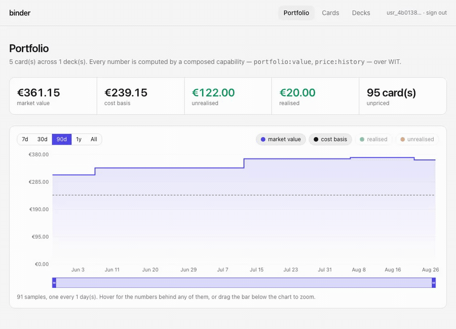

# binder — a Pokémon card collection that prices itself



**The recording is the real app**, seeded through its own routes: hovering the chart
for the numbers behind any day, switching the range (a server query, not a crop),
turning series on and off, then photographing a card — the upload answers in 0.00s
and the stream says `looking`, `reading`, and finally the row at the bottom of the
collection: *Pikachu · Base Set · 058/102 · 70%*, with `check` on the two fields the
model would not commit to. The card in it is drawn by the screencast, not scanned:
the art on a real card is somebody's, and a repository does not need a copy of it to
show that a model can read one.

Photograph a card instead of typing it in. A vision model describes what it sees,
`card:identify` turns that into typed fields and says which of them are still a
guess, and you correct the ones it got wrong. From there it is a portfolio: what
each card cost, what it is worth, and what selling has already made.

```bash
just host-binder      # composes, builds the SPA, serves on 0.0.0.0:3210
just e2e-binder       # the composed suite
```

The UI is a React + Vite SPA (`examples/binder/ui`) with routing — `/`, `/cards`,
`/decks`, `/decks/:name` — served by the host from `--static-dir`. The component
answers `/api/*` and nothing else, so the two are built and deployed apart.

## Why it is here

Every other showcase in this directory was written by a person. **This one's
capabilities were written by the loop** — all four, against held-out
specifications that existed before any of the code did:

| capability | held-out tests | model calls | attempts |
|---|--:|--:|--:|
| [`card:identify`](../../components/card-identify/wit/card.wit) | 19 | 1 | 1 |
| [`portfolio:value`](../../components/portfolio-value/wit/portfolio.wit) | 16 | 1 | 1 |
| [`price:history`](../../components/price-history/wit/price.wit) | 13 | 2 | 2 |
| [`deck:build`](../../components/deck-build/wit/deck.wit) | 14 | 1 | 1 |

The goal specs are in [`.comp/goals/`](../../.comp/goals/09-a-collection-that-prices-itself.md),
and each test file is `writable = []` — a candidate that could not pass the
specification could not edit it either.

## What it is composed from

`binder-domain` owns the HTTP surface and the storage. It owns none of the
arithmetic, and that is the point (ADR-0095): the pieces meet through WIT, so each
is tested on its own and none can be reached except through its contract.

| import | answers |
|---|---|
| `card:identify/identifier` | a model's answer → name, set, number, printing, condition, and **what to check** |
| `price:history/history` | what a card was worth at an instant, carried across the days nothing traded |
| `portfolio:value/valuation` | FIFO cost basis, realised and unrealised gain, the value series |
| `deck:build/builder` | whether a deck is legal, and what is missing from the collection to build it |
| `vision:describe/describer` | showing a model the photograph — the vendor is a deployment choice, not this app's |
| `auth:identity` | accounts and sessions; every key is scoped `u/<subject>/…` |
| `wasi:keyvalue/store` | the collection — one bucket, named by the linker after the app (ADR-0023) |

`just plug-wiring binder-domain` derives that list from the artifact's own imports
rather than from this table.

## The rules the recording is showing

**€20.00 realised, not €10.00.** Buy 2 @ €10.00, buy 1 @ €40.00, sell 1 @ €30.00.
FIFO consumes the *oldest* lot, so the copy that left cost €10.00. Average cost
would say €10.00 gain on a €20.00 average — a plausible number, and the wrong
answer to "did I do well on that one?".

**Unpriced cards named next to the total.** Bulk commons and a misprint nothing
lists are carried at *cost* and counted. Valuing them at zero makes the chart dip;
dropping them makes it climb. Neither is what happened.

**`— · check` on every field the AI guessed and nobody confirmed.** An absent field
is never defaulted. A collection where three hundred cards silently say "Near Mint"
is worth an unknown amount of money and no screen will show you which three hundred.

And in the chart: the line is **stepped, not smooth**. A market has no price on a day
nobody traded, so the last quote is carried forward and the point says so. A straight
line between two quotes invents movement that did not happen, and across five years
that invention is most of the line.

## The routes

| | |
|---|---|
| `GET /` and every SPA route | the app, from `--static-dir` |
| `GET /api/prompt` | the prompt a vision provider should send — from the capability that parses its output, so the two cannot drift |
| `POST /api/photo` | `{media_type, data}` → **202 and a job**. The browser downscales; the upload only stores |
| `GET /api/photo/{job}/events` | SSE: `looking` → `reading` → `done` (with the card) or `refused` (with what the model said). The vision call runs here, so the person watching is told what is happening instead of holding a spinner |
| `POST /api/scan` | `{answer}` → a card. Fenced JSON, prose either side, both fine. Not a card, or two cards, is a **422** and never a blank row |
| `POST /api/register` · `POST /api/login` · `GET /api/me` | accounts, via `auth:identity` |
| `GET` · `POST` · `PATCH` · `DELETE /api/cards` | the collection. Each row carries `held`, `cost_basis_minor`, its carried-forward `price_minor` and `value_minor` — computed from the same event log and quotes the portfolio total is, so a row cannot disagree with the figure above it. `price_minor` is **null** when nothing has priced it, never 0 |
| `GET` · `POST` · `PUT` · `DELETE /api/decks` | decks. `POST /api/decks/{name}/slots` adds or changes a line, quantity 0 removes it |
| `GET /api/decks/{name}` | legality and the shopping list, both at once |
| `POST /api/events` | what you paid, or sold it for. A swap is two of these |
| `POST /api/quotes` | an observed price. Where it came from is not this app's business |
| `GET /api/price/{id}` | 90 days, carried across gaps |
| `POST /api/events` | a buy or a sell. A sale of more than is held at that date is a **409 on the write**, not a broken portfolio later |
| `DELETE /api/events` | remove one. Name it fully (`card_id`, `at`, `kind`, `quantity`, `unit_minor`) and exactly that one goes |
| `GET /api/cards/{id}?days=N` | one card: what it is, what is held, its own price series (each point saying whether it was carried), every quote, every buy and sell, and every correction anyone made |
| `GET /api/portfolio?days=N` | the totals and the series. `days=0` is everything, computed from the earliest event — the range selector is a server query, not a crop |

## Trying it over a tailnet

`host-binder` binds `0.0.0.0` on purpose, so another machine on the tailnet reaches
it with no tunnel:

```bash
just host-binder &
open http://$(hostname):3210        # or http://<tailscale-ip>:3210
```

`apps/binder.toml` is the deploy spec, and `access` is left at **tailnet** — a
generated file must never be the reason an app is on the internet.

**One bad row does not take out every screen.** `portfolio:value` refuses an
oversold log by design — guessing which sale was wrong is a bigger lie than refusing
— but that refusal used to arrive as a 422 on `/api/portfolio`, which meant the
portfolio, the cards and the decks all went dark and there was no page left from
which to fix the event. The oversell is now refused on the WRITE, where a person can
act; and if a log is bad anyway, the portfolio answers with zeroes, says why, and
links to the card.

**A correction is history, not an overwrite.** The card is what it is — but "who
said Near Mint, and when did that change" is a different question the row cannot
answer, so every edit is appended with what the field was, what it became, and when.
An unchanged field writes nothing.

**The roster narrows by deck.** The collection is one list and a deck is a view of
it, so `/cards` filters in place — `all 3 · fire 2 · spare 1 · in no deck 0` — with a
live read on the chosen deck (size, legality, what finishing it costs) taken from the
SAME route the deck page uses, so the two verdicts cannot disagree. Every deck name
on a card links through to it.

**A card belongs to many decks.** A deck is a list that refers to the collection, so
building one does not take a card out of the binder — `GET /api/cards` reports
`in_decks` per card, and deleting a deck deletes the list and nothing else.

**Eight Charmander across two printings is illegal.** The four-copy cap counts
NAMES, and counting the id the collection is keyed on reads that as four and four.

## What is deliberately not built

- **No API key in the tenant, on purpose.** The camera works through
  `tools/claude-shim.mjs`: `components/anthropic-vision` reads `vision:base-url` from
  config and demands a secret only when it is pointed at `anthropic.com`, so the
  default deployment runs the vision call on a subscription with no key anywhere in
  the app. Start the shim, then `just host-binder`. Pointing it back at the metered
  API is one config line plus a granted secret (`fixtures/photo-critic.yaml` is the
  shape) — and the interface a guest sees is identical either way, which is what
  makes it a deploy-time choice.
- **No price source.** Quotes are POSTed. A `pokemontcg.io` fetcher goes behind
  `price:history` the way `anthropic-provider` sits behind `llm:inference`.
- **No marketplace yet.** The signed-QR custody handoff is `webhook:sign` +
  `idempotency:guard` + `qr:encode`, all already in the pool — no new contract.
- **The store is in memory** when run this way, so a restart empties it. `kv =
  "sqlite"` in the deploy spec is what survives.
