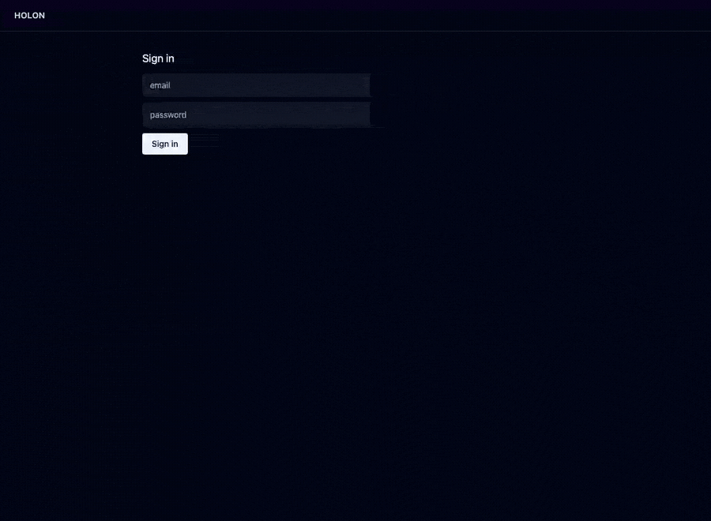

# console — the Holon console (a run, after the terminal closed)

The **browser surface for the loop**: sign in against the platform, read a
project's worklist, author a new goal as a **pull request**, and open a finished
run to see what actually happened inside it — every branch it spawned, what each
one wrote, what the gate said, and what the pool can do now that it could not
before.

It is the only showcase whose subject is *this repository's own machinery*. The
others prove a capability; this one is the window onto the thing that builds
them.



## A second client, not a second control plane

`platform-domain` already serves `/api`, and the `holon` CLI is a client of it.
The console calls the **same endpoints the same way**. It imports no
`records:store`, no `auth:identity` and no `policy:guard`, so there is exactly
one place that knows the control plane's storage layout and exactly one place
that decides who anyone is.

| what it imports | why it is unavoidable |
| --- | --- |
| `ui:assets/files` | the SPA, embedded in `console-assets` and served from the wasm — no `--static-dir` |
| `git:forge/repo` | a goal's spec is prose in git ([ADR-0082](../adr/0082-a-project-owns-a-repo-and-a-queue.md)) and a component has no filesystem, so authoring one from a browser is six HTTP calls that become a branch, a commit and a pull request |
| `knowledge:graph/store` | the run view reads the merged store directly ([ADR-0091](../adr/0091-one-store-one-schema.md)); run history is not control-plane data |
| `wasi:http/outgoing-handler`, `wasi:config/store` | reaching the platform, and being told where it is |

`git:forge` is the interesting one. The control plane does **not** get that
capability in order to satisfy a UI — the console holds it, and the console is
the thing that opens pull requests.

## The session is a cookie, and the platform never sees a cookie

The platform speaks bearer tokens; that is what the CLI stores. A browser should
not. This page renders model-written prose — goal specs, lessons, gate verdicts,
diffs — and a token any script can read is a bad pairing with a page showing
output an agent can be influenced into producing.

So the console holds the token in an `HttpOnly` cookie and puts it on the
`Authorization` header of every call it forwards. **The token never reaches
JavaScript.** A goal containing `` renders as text, and
there is a test that says so.

## Authoring a goal is two writes, and the order matters

A goal is prose in git **plus** a row in the platform. Authoring one from a
browser is therefore a pull request *and* a queue entry.

The pull request goes first. If the queue entry fails, the result is an open PR
nobody queued — visible, revertable, obviously incomplete. The other order
leaves a queue entry pointing at a spec path that does not exist, which looks
fine until something tries to run it.

The entry is created `queued` and **nothing starts it**. That is
[ADR-0082](../adr/0082-a-project-owns-a-repo-and-a-queue.md)'s stance and this UI
does not get to relax it: starting a run spends money and opens pull requests, so
it stays a deliberate act.

## A run is a graph, because a run has a shape

`run → round → attempt → capability`, read left to right, laid out by arithmetic
— the column is the depth ([`@xyflow/react`](https://reactflow.dev) ships no
layout engine, and a run is a tree of known depth, so it does not need one).

The flat list this replaced could tell you that branch 3 beat branch 7. It could
not tell you they were the **same round** — which is the difference between a
fan-out and a for-loop, and the whole reason the loop spawns branches at all.

| what you see | where it comes from |
| --- | --- |
| every branch, winners and losers | `attempt` rows ([ADR-0092](../adr/0092-a-run-leaves-a-trace.md)) — a failed branch teaches nothing retrievable, and is the only evidence for why the winner won |
| each branch's cost, duration and paths | `attempt`; they exist nowhere else once the terminal is gone |
| the gate's verdicts, in order | `event` rows, in the vocabulary ADR-0092 defines |
| **what the pool gained** | `capability` rows ([ADR-0089](../adr/0089-capability-accumulation.md)) — the only part of a run that outlives its pull request |
| a capability the pool **lacks** | `capsearch-miss`, the most actionable row on the page: the graph naming what to build next |

Clicking a branch opens its panel and **highlights** its rows in the timeline
rather than filtering to them. Filtering would destroy the interleaving, and the
interleaving is the only thing on the page that shows two branches running at the
same time.

## Polled, not pushed — and the grace period is the interesting part

An unresolved run is refetched every two seconds, and for three more polls
**after** it resolves.

Not zero. `trace.rs` writes a run's resolution and its last attempts and events
as separate statements, and it *counts* dropped writes rather than retrying them,
so the tail of a run can land after the resolution does. Stopping the instant
`resolved_at` appears truncates the timeline exactly at the end — the part
somebody opened the page for.

A socket replaces one function and nothing else, once `ws:socket/handler` has an
ADR of its own. That ordering is deliberate: a host capability gets a contract
before it gets an implementation.

## Bounds

The event log is capped at 500 per response and the page **says so** when it
truncates — a timeline that silently stops at 500 looks like a run that stopped
at 500, which is the more expensive mistake. The run list is capped at 50.

The graph is capped at nothing, on purpose: `branches × rounds` is bounded by two
numbers a person typed on a command line. The header states the size, so a graph
that has been panned off-screen is not mistaken for a graph that is missing nodes.

## Run it

```bash
just host-console        # composes and serves on :3055
just e2e-console         # Playwright against the real stack, nothing stubbed below the browser
```

`host-console` needs `platform-url` pointing at a running platform, and
`surreal-url` at the store the loop writes its trace to. The e2e recipe brings up
its own SurrealDB and a stand-in platform, and fails loudly rather than skipping
if it cannot — a green suite that talked to nothing is worse than a red one.

## What it does not do

- **No run is started from here.** Deliberate ([ADR-0082](../adr/0082-a-project-owns-a-repo-and-a-queue.md)).
- **No interrupt.** ADR-0092 records the `interrupted` outcome so the rate can be
  understood before the feature is designed; nothing produces one yet.
- **No merged view across runs.** The capability graph over the whole pool is a
  different picture with a different shape, and picking its layout before looking
  at it would be choosing a tool for an unexamined problem.
- **No ADR of its own, yet.** The console's shape is currently the sum of
  ADR-0082, ADR-0091 and ADR-0092. It earns one when goal-authoring-as-a-pull-request
  has run for real against a live forge rather than against a test double.
