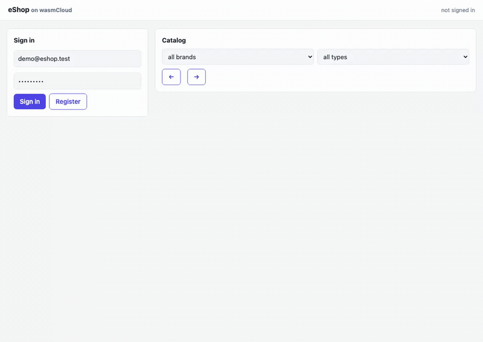

# eshop — eShopOnDapr recreated on wasmCloud

[eShopOnDapr](https://github.com/dotnet-architecture/eShopOnDapr) (Microsoft's
archived Dapr reference shop) rebuilt as holon components: every Dapr building
block becomes an existing capability contract, every service a wasm component,
and the whole thing runs three ways from the same bytes — jco-style native
host, `just host-eshop` locally, and wasmCloud v2 WorkloadDeployments on
Kubernetes.



## The mapping (the point of the exercise)

| eShopOnDapr | here |
|---|---|
| Dapr state store (Redis) | `records:store` over wasi:keyvalue (NATS JetStream on k8s) |
| Dapr pub/sub (RabbitMQ) | `event:bus` — durable topic log, per-group offsets, shared KV bucket |
| Dapr actors + reminders (order grace period) | `fsm:workflow` machine per order + pump-driven grace sweep |
| IdentityServer (Identity.API) | `accounts-app` + composed `auth-guard` (sessions in the shared bucket, so every service introspects the same token) |
| Envoy gateway + Blazor UI host | `eshop-gateway`: embedded single-file storefront + `proxy:route` (config route table + forwarding as a capability) |
| Dapr config/secrets | wasi:config (`grace-period-secs`, `payment-succeeds`, service URLs) |
| SignalR order-status push | storefront polls `GET /api/orders` *(simplification)* |
| per-service databases | one shared bucket, records-collection isolation *(simplification)* |

Integration event names are the original's, verbatim: `UserCheckoutAccepted`,
`OrderStarted`, `OrderStatusChangedTo{Submitted,AwaitingStockValidation,Validated,Paid,Shipped,Cancelled}`,
`OrderStockConfirmed/Rejected`, `OrderPaymentSucceeded/Failed`.

## Services (`components/eshop-*`)

| service | does | composes |
|---|---|---|
| **identity** | register/login/me/logout, roles | accounts-app + auth-guard (reused wholesale, zero new code) |
| **catalog** | seeded demo catalog, paging + brand/type filters; answers stock validation, decrements on paid (deduped per order) | records, event-bus, idempotency-guard |
| **basket** | per-buyer basket document; checkout → `UserCheckoutAccepted` (202); cleared on `OrderStarted` | auth-guard, records, event-bus |
| **ordering** | order aggregate; lifecycle = declarative FSM `submitted → awaitingStockValidation → validated → paid → shipped` (+ `cancelled`); grace-window cancel; list/get/cancel/ship; order creation deduped per bus event id | auth-guard, records, fsm, event-bus, idempotency-guard |
| **payment** | consumes `...ToValidated`, answers success/failure per `payment-succeeds` | event-bus |
| **gateway** | embedded storefront + `/api/*` forwarding + `/internal/pump` fan-out | proxy-route (route table + outgoing HTTP as a contract) |

At-least-once delivery is handled where it matters: the FSM naturally dedupes
status transitions; the two non-idempotent consumers (order creation, stock
decrement) compose `idempotency:guard` — verified exact-once under
deliberately racing pump drivers (20 checkouts → exactly 20 orders / 20
decrements).

The checkout choreography, exactly as in the original:

```
basket ──UserCheckoutAccepted──▶ ordering ──OrderStarted──▶ basket (clears)
ordering (grace expires) ──…AwaitingStockValidation──▶ catalog
catalog ──OrderStockConfirmed──▶ ordering ──…ToValidated──▶ payment
payment ──OrderPaymentSucceeded──▶ ordering ──…ToPaid──▶ catalog (stock −)
```

`event:bus` is pull-based, so consumers drain on `POST /internal/pump`. On k8s
the drains are **push-driven**: `event-pusher` (`event:push@0.1.0`) exports the
`wasmcloud:messaging` handler, subscribed to the bus seq keys' JetStream-KV
change subjects (`$KV.default.eb.seq.>`) — every publish pokes the consumers
within ~100ms. The `eshop-pump` Deployment remains as a 10s sweep for what no
KV change announces (grace-period expiry) and for notifications the
at-most-once push drops. The open storefront page and the smoke script also
pump (needed on the native lane, which has no messaging plugin).

## Run it

```bash
# local — native hosts over one shared NATS (docker run -d -p 4222:4222 nats:2.10 -js)
just host-eshop                  # storefront at http://127.0.0.1:3100
GATEWAY=http://127.0.0.1:3100 examples/eshop/smoke.sh

# there was a kubernetes lane, on the wasmCloud v2 runtime-operator, driven by a
# `k8s-eshop` recipe. It went when this repository stopped being connected to
# wasmCloud; `examples/eshop/k8s/` and the numbers it produced are still in git
# history. The native lane above is the one that runs.
```

`examples/eshop/smoke.sh` asserts the whole flow: register → browse → basket →
checkout 202 → pump until **paid** → stock decremented → basket cleared →
FSM history correct → second order cancelled inside the grace window.

## Bench + DX evaluation

See [bench/ESHOP-BENCH.md](../../bench/ESHOP-BENCH.md): 18.6k rps SPA / 2.9k rps
catalog / 184 rps login (argon2) on one hostgroup pod, ~23% gateway-proxy tax,
choreography drain ≈1.8 orders/s per pump driver — plus the honest list of
what the component library covered (everything below the domain layer) and
what was missing (push delivery, a proxy capability, consumer-loop helper).

## Non-goals (v1)

Coupons/loyalty (the original has none either), real payment, per-service
storage isolation, SignalR-style push, image assets for catalog items.
