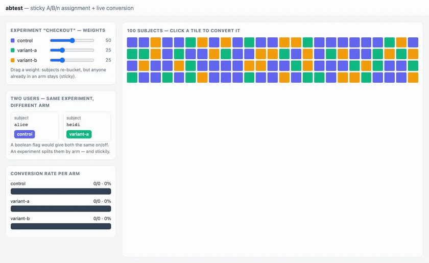

# experiment — context-based A/B testing, from assignment to conversion

A live **A/B/n experiment** console: bucket every subject into a **named
variant** (`control` / `variant-a` / `variant-b`) by weight, **stickily** (a
subject never switches arms mid-experiment), record an **exposure** when they
see it and a **conversion** when they act, and watch the **per-variant
conversion rate** update live over SSE. Chosen because it's the axis the `flags`
showcase implies but can't reach: flags decide **on/off** (2 arms, no
attribution); an experiment needs **named weighted variants + outcome
measurement** — assignment *and* the metric that judges it.

Two new capability contracts fall out of this, both WIT-first and backed only by
generic WASI — reusable far beyond the showcase:

- **`experiment:assign`** — weighted, sticky, named-variant bucketing (the A/B
  primitive `featureflags:guard` isn't: flags are boolean; this returns a
  *variant name* from an N-way weighted split).
- **`metrics:collect`** — a tiny per-key counter/rate store (exposures,
  conversions, and the rate between them), the attribution half every
  experiment, funnel, or SLO needs.

The showcase is one **`abtest-domain`** HTTP component that composes them; the
domain is composition, not a bespoke experiment engine.



## Why it subsumes "context-based rollout"

The per-user / per-segment / 50-50 cases live *inside* this as ordinary
configurations, so we don't need a separate rollout example:

| you want | express it as |
|---|---|
| 50/50 A/B | two variants, weights `50/50` |
| gradual rollout of one treatment | `control:90, treatment:10`, raise `treatment` over time |
| per-user targeting | the `subject` is the user id — assignment is sticky per user |
| per-segment / per-tenant | the `tenant` scopes the experiment; a tenant can carry its own weights |
| holdback / control group | a `control` variant that never changes |

Stickiness is the property you can *see*: shift `variant-a` from 25%→40% and the
tiles that were already A **stay** A — new tiles only ever *join* an arm, they
never jump between treatments (a subject that flip-flopped would corrupt the
experiment). Same stable-hash trick as `featureflags:guard`, but bucketed across
a **weighted cumulative range** instead of a single threshold.

## The two new contracts

### `experiment:assign`

```
record variant   { name: string, weight: u32 }        // relative weights, normalized
record context   { tenant: string, subject: string }  // sticky bucketing key

// Define / replace an experiment's variant set (runtime, no redeploy).
set-experiment: func(name: string, tenant: string, variants: list<variant>) -> result<_, err>;
// Assign a subject to a variant — deterministic + sticky by hash(subject).
assign:         func(name: string, ctx: context) -> result<string, err>;   // returns variant name
// Inspect an experiment's variant set + effective weights.
describe:       func(name: string, tenant: string) -> result<list<variant>, err>;
// Evaluate the whole synthetic cohort for the console grid.
cohort:         func(name: string, tenant: string, n: u32) -> result<list<assignment>, err>;
```

Backed by `wasi:keyvalue` (variant sets) — no clock, no randomness (the hash is
the "randomness", and it must be deterministic). Bucketing: normalize weights to
a 0..=999 range, `hash(subject) % 1000` picks the arm by cumulative weight.
Raising one variant's weight only extends its slice — subjects already inside
it stay, which is *why* it's sticky.

### `metrics:collect`

```
// Bump a named counter (e.g. "exp:checkout:variant-a:exposed").
incr:   func(key: string, by: u64) -> result<u64, err>;
// Read one counter.
get:    func(key: string) -> result<u64, err>;
// Read a family by prefix (e.g. all "exp:checkout:*") — for the dashboard.
scan:   func(prefix: string) -> result<list<counter>, err>;
// Convenience: rate = numerator / denominator counters (conversion / exposure).
rate:   func(num-key: string, denom-key: string) -> result<f64, err>;
```

Backed by `wasi:keyvalue/atomics` (so concurrent `incr` is race-free) + clocks
for a last-updated stamp. Reusable for funnels, SLO error-budgets, feature-usage
counts — anywhere you count events and want a ratio.

## Product surface (`abtest-domain`, anonymous)

```
POST /api/experiments/{name}   {tenant, variants:[{name,weight}]}  define / reweight
GET  /api/experiments/{name}   ?tenant=                            describe variants
GET  /api/assign               ?exp=&tenant=&subject=              one subject's arm
GET  /api/cohort               ?exp=&tenant=&n=100                 the grid (arm per subject)
POST /api/expose               {exp, tenant, subject}              record an exposure
POST /api/convert              {exp, tenant, subject}              record a conversion
GET  /api/results              ?exp=&tenant=                       per-variant exposed/converted/rate
GET  /api/stream               ?exp=&tenant=                       LIVE SSE (assignment + results)
GET  /                                                             usage
```

All routes under `/api/…` (static-dir SPA fallback rule, same as pulse/pipeline/flags).

## Component map

**New contracts (2):** `experiment:assign` (weighted sticky named-variant
bucketing), `metrics:collect` (counter/rate store). Each is a standalone
WIT-first capability with a `jco` example + a bench row, like every other entry
in the catalog.

**Showcase — reused (3):** `experiment:assign`, `metrics:collect`, `event:bus`
(fan-out + SSE cursor). Plus `id:generate` (event ids) and host WASI
(`wasi:clocks/monotonic-clock` for the SSE sleep, `wasi:io` for the stream).

**New domain (1):** `abtest-domain` — `abtest:app` exports `wasi:http`. The
console routes + the SSE loop; assignment and measurement are entirely the two
new contracts.

**Not used:** `featureflags:guard` (boolean rollouts — this is the N-way,
attributed successor for experiments; flags stay the right tool for kill-switches
and simple gates).

## Build order (each rung is demoable)

1. **`experiment:assign` contract + jco example** — `set-experiment` / `assign`
   / `cohort`; unit-prove stickiness (a subject's arm is stable) + weight
   monotonicity (raising a weight only *adds* subjects to that arm).
2. **`metrics:collect` contract + jco example** — `incr` / `get` / `scan` /
   `rate`; race-free atomic counters.
3. **`abtest-domain` + live SSE** — assign a cohort, expose/convert, results;
   `GET /api/stream` pushes each assignment + results update as a `data:` frame.
   `just e2e-abtest` round-trips and proves a live conversion updates a separate
   held-open SSE connection.
4. **Console UI** — variant weight editor + a 100-tile grid colored by arm +
   per-variant conversion-rate bars. Shift a weight and watch sticky
   reassignment; click subjects to convert and watch the winning arm's bar pull
   ahead. `just host-abtest`.
5. **Bench** *(follow-up)* — assignment throughput + distribution accuracy (does
   a 50/25/25 config actually split ~50/25/25 across 10k subjects?) and counter
   contention under concurrent `incr`. Distribution accuracy is already asserted
   in `e2e-abtest` (a 500-subject cohort lands within tight bands of the
   configured weights); the standalone bench round is a later addition.

## Non-goals (v1)

Statistical significance / p-values (the console shows raw rates, not a
significance verdict — a real experiment platform layers stats on top; out of
scope for a composition showcase), multi-armed-bandit auto-reweighting, and
per-subject event history (metrics are aggregate counters, not an event log —
`event:bus` is there if you want the log).
