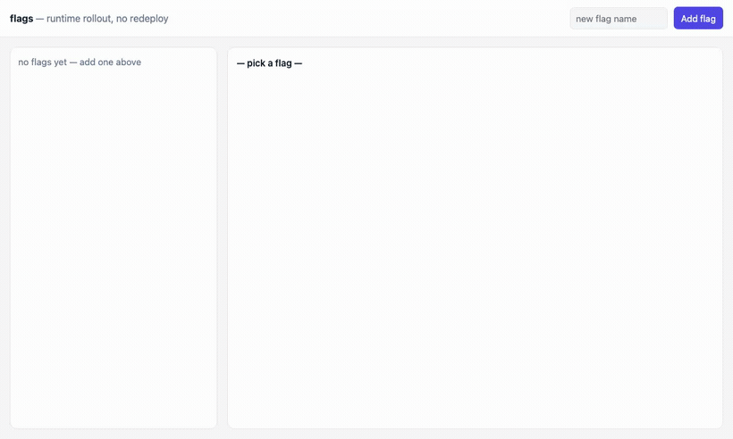

# flags — a live feature-rollout console (set a rule, watch it propagate)

A **rollout console**: flip a flag, drag a percentage slider, or trip a
kill-switch — and every open window updates *instantly*, with each affected
subject **sticky** (a given user never flickers on/off). Chosen because it's the
one axis none of the other showcases exercise: **runtime behavior change with
no redeploy, propagated to live connections**. Every other showcase decides
behavior at deploy/compose time; here the behavior of a running system changes
under you and fans out over a held-open stream.

Same shape as the rest: one **`flags-domain`** component that exports
`wasi:http` and imports only WIT contracts. The pattern is demonstrated by
composing catalog primitives — no bespoke flag engine, no business crate.



## Why it's almost pure composition

| flags concern | contract | how |
|---|---|---|
| evaluate "is flag X on for this subject?" | `featureflags:guard` | `is-enabled` with stable-hash percentage bucketing (sticky subjects), tenant-scoped |
| set / clear a rule at runtime (define a flag with no redeploy) | `featureflags:guard` | `set-rule` / `clear-rule` — full replace, idempotent; `list-flags` reports effective rule + source |
| a rule change fans out to every open console + simulated client | `event:bus` | publish `flags:{tenant}` on every `set-rule` / `clear-rule` |
| live push to the browser | **SSE** (same as pulse) | `GET /api/stream` holds open, writes each rule change as a `data:` frame |
| cross-host fan-out (rung 4) | `event:push` | NATS-KV change notifications drive drains — the multi-host upgrade for free |

The domain logic is a thin HTTP surface over `featureflags:guard` plus a
publish-on-change; the whole reliability/stickiness story lives in the contract.

## The new axis

The stable-hash bucketing is the point you can *see*: set a flag to 30% and
~30 of 100 subject tiles light — and they're the **same** 30 every evaluation.
Nudge to 40% and 10 more join; **none already-on turn off**. That's the
difference between a real rollout (sticky cohorts) and `rand() < 0.3`
(flicker), made visible. The kill-switch (`disabled` rule wins over any
config/percentage) darkens all 100 in one frame — the propagation latency is
the SSE round trip, no redeploy.

## Product surface (one component, anonymous)

No auth on the console for the demo (tenant is a query param); in production the
console sits behind `auth-guard` + `policy:guard` — orthogonal, shown elsewhere.

```
GET  /api/flags            ?tenant=              list flags + effective rule + source (JSON)
POST /api/flags/{name}     {tenant, rule}        set a runtime rule (enabled|disabled|percentage:N)
DEL  /api/flags/{name}     ?tenant=              clear a runtime rule (fall back to config)
GET  /api/eval             ?flag=&tenant=&subject=   evaluate one flag for one subject (JSON)
GET  /api/cohort           ?flag=&tenant=&n=100  evaluate a flag across N synthetic subjects (the grid)
GET  /api/stream           ?tenant=              LIVE SSE stream of rule changes (text/event-stream)
GET  /                                           usage
```

All routes under `/api/…` (static-dir SPA fallback rule, same as pulse).

## Domain model

Rules live entirely in `featureflags:guard` (runtime rules in its key-value
store; config-defined flags from `wasi:config`). The domain stores nothing
durable of its own — it evaluates, mutates rules, and publishes each change on
`event:bus`. The SSE cursor is a monotonic `seq` on the event-bus stream (same
trick as pulse). Synthetic subjects for the grid are just `subject-0 …
subject-99` — the stickiness is a property of the contract's hash, not of
stored state.

## Component map

**Reused as-is (3):** `featureflags:guard` (evaluation + runtime rules),
`event:bus` (fan-out + SSE cursor), `id:generate` (change-event ids). Optional
rung 4: `event:push` (cross-host propagation). Plus host WASI:
`wasi:clocks/monotonic-clock` (SSE poll sleep) + `wasi:io` (the stream).

**New (1):** `flags-domain` — `flags:app` exports `wasi:http`. The console
routes, cohort evaluation, and the SSE loop.

**Not used (v1):** `auth-guard` / `policy:guard` (console is anonymous for the
demo; the production gate is orthogonal).

## Build order (each rung is demoable)

1. **Evaluate + set** — `GET /api/eval`, `POST/DEL /api/flags/{name}`,
   `GET /api/flags`. `just e2e-flags` sets a 30% rule and asserts a known
   subject is sticky across repeated evals.
2. **Cohort + live SSE** — `GET /api/cohort` returns the on/off grid for N
   subjects; `set-rule` publishes on event-bus; `GET /api/stream` pushes each
   change as a `data:` frame. e2e: a reader thread sees a rule flip made by a
   separate request, live.
3. **Console UI** — flag editor (toggle / % slider / kill-switch) + a 100-tile
   subject grid that re-renders on each SSE frame. Served via `--static-dir`
   (native `EventSource`); `just host-flags`, drag the slider, watch cohorts.
4. **Cross-host fan-out (`event:push`)** — a rule set on host A propagates to a
   console held open on host B via NATS-KV notifications. The multi-host
   upgrade, and a bench: **one rule flip → M consoles updated**, latency
   distribution. See `bench/FLAGS-BENCH.md`.

## Non-goals (v1)

Flag dependencies / prerequisite graphs, scheduled rollouts (arrive later via
`sched:timer`), audit of who-changed-what (add `audit:log` when the console
gains auth), and experiment/metrics attribution (a flag *decides*; measuring the
outcome is a separate concern).
