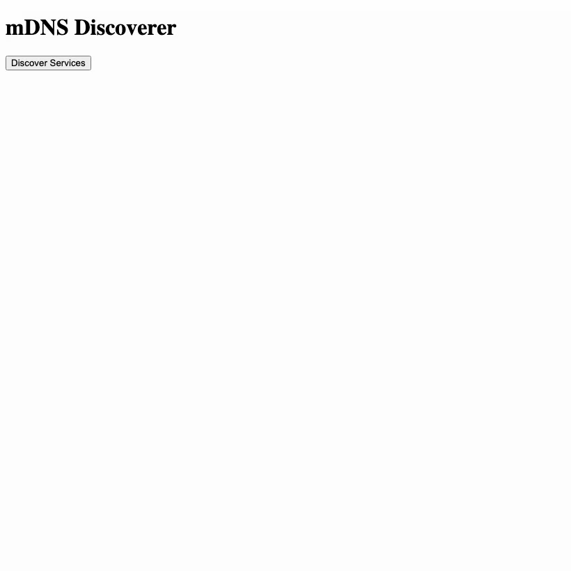

# mDNS Discoverer

This is a showcase application that fronts the `mdns-discovery` capability over HTTP
(`components/mdns-discoverer-domain`). It bridges the WebAssembly sandbox to the host
environment natively.

