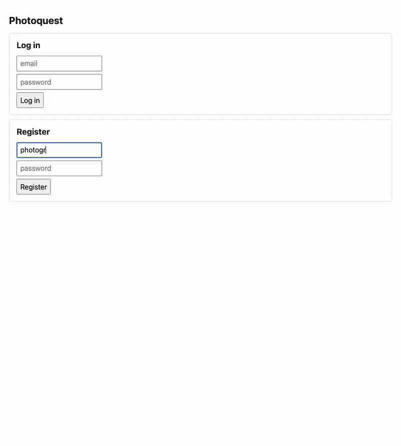

# photoquest — raw photos evaluated on the machine with the GPU



A **photo-evaluation app**, and step one of a game built on it: sign up, drop a
129 MB Sony ARW onto the page, and a couple of seconds later see it developed,
with its camera metadata, a web-share copy under 10 MB, a per-tile sharpness map,
the sharpness under each face Vision found, labels and an aesthetics score.
Quests, XP and levels come next. They plug into `quests::on_evaluated` in
`components/photoquest-domain/src/quests.rs`, which runs exactly once per photo
and does nothing yet.

It is here because it is the one showcase whose payload no part of the runtime
can carry. A guest has 64 MiB, every body read stops at 16 MiB, a NATS value is
1 MB. So the bytes never touch a component: the browser uploads them **straight
to S3-compatible storage by presigned multipart**, and a native daemon,
`comp-media`, queues and evaluates them.
[ADR-0098](../adr/0098-photos-live-in-object-storage.md) has the reasoning and
the measurements.

## How it fits together

| piece | what it does |
|---|---|
| `photoquest-domain` | accounts, the `photos` records, who may upload or read what, and verifying the evaluator's signed callback ([CONTRACT](../../components/photoquest-domain/CONTRACT.md)) |
| `media-pipeline` | the `media:pipeline` WIT contract; each call is one loopback HTTP request to `comp-media` ([CONTRACT](../../components/media-pipeline/CONTRACT.md)) |
| `comp-media` (`reconciler/src/bin/media.rs`) | signs upload and rendition URLs, owns the `MEDIA_JOBS` JetStream work queue, and evaluates one photo at a time (`rawler` decode, `green-stab-v1` sharpness). It POSTs the result to `public-callback-base`, signed with `media-callback-secret`, and only to a `--callback-allow` host:port |
| `comp-media-apple` (`tools/media-apple/main.swift`) | macOS only: Core Image develop, Metal sharpness, Vision. Without it the daemon does the same on the CPU with no Vision stage, and the result says which backend ran |
| RustFS (`infra/compose.yaml`, profile `media`) | the object store: `originals` and `renditions` buckets |

## Run it locally

```sh
# 1. The store and a JetStream-enabled NATS (the compose nats runs with -js).
docker compose -f infra/compose.yaml --profile media up -d rustfs nats

# 2. The Swift helper, where apps/photoquest.toml's --apple-helper looks for it.
#    Optional: without it, evaluation runs on the CPU.
swiftc -O -o reconciler/target/comp-media-apple tools/media-apple/main.swift

# 3. Compose if needed, start comp-media per [[daemon]], serve on :3941.
cargo xtask host photoquest
```

Then open <http://127.0.0.1:3941>. Browser CORS for the part uploads comes from
comp-media's `--cors-origin` (bucket CORS with `ETag` exposed). Do not also set
`MEDIA_CORS_ORIGINS` on the store: once a bucket has its own rule, that rule
replaces the listener-wide list. The toml's credentials and callback secret are
fixed local-dev values. A real deployment changes the secret on **both** sides
(`[config] media-callback-secret` and `--callback-secret`) and sets `token` and
`media-token` together. When comp-media reaches the store by an internal name,
set `--s3-public-endpoint` to the name browsers use.

comp-media reads its NATS from `--nats-url`, or from **`MEDIA_NATS_URL`** when
the flag is not given (default `nats://127.0.0.1:4222`). `cargo xtask host`
passes its environment to the daemons it spawns, so a JetStream somewhere else
needs no edit to `apps/photoquest.toml`:

```sh
MEDIA_NATS_URL=nats://127.0.0.1:14222 cargo xtask host photoquest
```

That matters on a dev box where :4222 already belongs to some other NATS —
without JetStream, or with another project's streams in it.

`reconciler/tests/gate_photoquest.rs` is the gate. It runs the composed
component against a recording fake `comp-media`, so it needs no store, queue or
GPU: `COMP_HOST=… cargo test --release --test gate_photoquest` in `reconciler/`.

## Scenarios

[`e2e/tests/photoquest.spec.js`](../../e2e/tests/photoquest.spec.js) is the
end-user suite: a real browser against the whole stack (RustFS, a private
JetStream, comp-media with the Swift helper on a Mac, the composed app), with
only CC0 photos. `bash e2e/photoquest.sh` brings all of it up, runs the spec
and tears everything down again; [e2e/README.md](../../e2e/README.md#photoquest)
has the prerequisites.

What a photographer can do today, each one a passing scenario:

- **Account** — register and be signed in; log out and in again; a wrong
  password and an email that already has an account are refused with a message.
- **Upload and evaluate** — an uncompressed and a lossless-compressed a7R V ARW
  and a JPEG are each evaluated; the ARW's detail shows camera, lens, exposure,
  size, the sharpness focus ratio, Vision labels and aesthetics, and which
  backend ran. A JPEG shows what it has without empty or "undefined" rows.
- **Share copy** — the share link is a JPEG under 10 MB, with no EXIF tag
  beyond the structural ones Core Image always writes: no serial, MakerNote,
  make, model, lens, date or GPS.
- **Refusals** — a text file or a PNG is refused, saying which file and what is
  accepted, and leaves no photo behind.
- **Gallery** — newest first, thumbnails load, a click opens the detail.
- **Resilience** — reloading while a photo is still being evaluated picks it up
  again, and it ends `evaluated` without a click.
- **Privacy** — another photographer gets 403 reading or completing my photo and
  never sees it listed; on a shared browser, logging out leaves nothing of mine
  on the page for the next person.

The next steps are written down in the same file as `test.fixme` scenarios, so
they have acceptance tests before they have code: quests (active list, a verdict
with a reason per requirement, XP awarded once per photo and file, a photo taken
before the quest refused), levels and XP history, journeys (quests unlock in
order, a badge at the end), timed competitions (entry deadline, leaderboard,
results) and the effect of moderation. They need two roles that do not exist
yet: a **curator**, who creates quests, journeys, levels and competitions, and
an **admin**, who moderates.

## Where it stands

Step one works end to end on a real box. Two a7R V ARWs (129 MB each), uploaded
through the page on an M2 Max:

- the upload takes about 0.2 s over loopback
- evaluation takes about 2 s, warm, from `complete` to `evaluated`
- the in-focus face scores about 60 and 107; the other face in each frame scores 0.2 and 1.6
- the share copy is 2–2.6 MB

Not built yet: quests, XP and levels, EXIF for JPEG originals, and the
original's lifecycle once it has been evaluated (it stays in `originals`).
