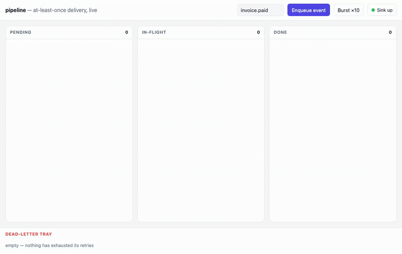

# pipeline — a reliable event pipeline (outbox → dispatch → DLQ → replay)

An **at-least-once event pipeline**: an event arrives, is enqueued durably, a
relay claims it and calls a downstream sink, and *when the sink is down* the
event **retries with backoff** and — after the ceiling — drops to a
**dead-letter** tray you can **replay**. Chosen because it's the one axis none
of the other showcases exercise: **reliable async delivery with visible failure
+ recovery**. Saga rolls *back*; this one keeps *trying forward* and never
loses an event. (SAGA.md even admits `outbox:dispatch` is "wired for that
upgrade" but unused — this is the upgrade.)

Same shape as the other showcases: one **`pipeline-domain`** component that
exports `wasi:http` and imports only WIT contracts. The pattern is demonstrated
by composing durable primitives already in the catalog — no bespoke queue, no
business crate.



## Why it's almost pure composition

Every hard part of a reliable pipeline already has a contract:

| pipeline concern | contract | how |
|---|---|---|
| durable queue (enqueue atomically, survive a crash) | `outbox:dispatch` | `enqueue` / `claim` (leased) / `ack` / `fail` (backoff) / `dead-letters` / `replay` — the whole reliability core, one contract |
| each state change fans out to every open board | `event:bus` | one stream: `enqueued` / `in-flight` / `acked` / `retry` / `dead` / `replayed` |
| live push to the browser | **SSE** (same as pulse) | `GET /api/stream` holds the connection open, writes each state change as a `data:` frame |
| ids, timestamps | `id:generate`, `wasi:clocks` | event / transition ids, per-transition timestamps |

The relay loop (claim → dispatch → ack/fail) is the only domain logic — a few
dozen lines pumping the `outbox` contract. Everything durable is the contract.

The downstream sink is **simulated inside the relay** in v1 (an up/down control
event on `event:bus`) so the flaky-sink toggle is deterministic for the demo —
no real outbound HTTP to a service that might be genuinely up. The natural
production upgrade swaps that simulated dispatch for `notify:dispatch` (real
webhook/email/sms) and puts `webhook:ingest` (HMAC verify + `idempotency:guard`
dedup) in front of `POST /api/events` — both are catalog contracts, wired the
same way; neither changes the reliability core.

## The new axis vs. saga

`saga` and `pipeline` are the two reliability showcases and are deliberately
complementary:

| | saga | pipeline |
|---|---|---|
| failure response | **compensate** (undo booked legs in reverse) | **retry forward** (backoff, then DLQ) |
| delivery shape | orchestrated multi-step transaction | at-least-once fan-out of independent events |
| recovery | resume from durable state after a host kill | **replay** a dead-lettered event |
| headline contract | `fsm:workflow` | `outbox:dispatch` |

## Product surface (one component, anonymous)

No auth — a pipeline is driven by event, like a queue runner. (Auth is
orthogonal and shown elsewhere.)

```
POST /api/events           {topic, payload}     enqueue an event (via webhook:ingest, deduped)
GET  /api/events           ?after=seq           snapshot / catch-up (JSON: every event + state)
GET  /api/stream           ?after=seq           LIVE SSE stream of state changes (text/event-stream)
POST /api/sink             {up: bool}            demo knob: take the downstream sink up/down
GET  /api/dead-letters                           list dead events (JSON)
POST /api/dead-letters/{id}/replay               move a dead event back to pending
GET  /                                           usage
```

All routes under `/api/…` so the host's static-dir SPA fallback doesn't shadow
`GET /api/stream` (same rule as pulse).

## Domain model

Events live entirely in `outbox:dispatch` (its `event` record already carries
`id`, `topic`, `payload`, `state`, `attempts`, `created`, `not-before`). The
domain adds nothing durable of its own — it only *pumps* the outbox and
publishes each transition on `event:bus`. The SSE cursor is a global monotonic
`seq` on the event-bus stream (same trick as pulse).

## Component map

**Reused as-is (3):** `outbox:dispatch` (the durable queue + DLQ + replay),
`event:bus` (the fan-out spine + SSE cursor + the sink up/down control topic),
`id:generate` (event / transition ids). Plus host WASI:
`wasi:clocks/{wall-clock,monotonic-clock}` (timestamps + the relay poll sleep)
and `wasi:io` (the SSE response stream).

**New (1):** `pipeline-domain` — `pipeline:app` exports `wasi:http`. The ingress
routes, the relay pump (claim → dispatch → ack/fail), and the SSE loop.

**Wired for the production upgrade (not v1):** `webhook:ingest` (HMAC + dedup
ingress) and `notify:dispatch` (the real sink) — see the composition table
above. **Not used:** `auth-guard` (anonymous, event-driven). `fsm:workflow`
(that's saga's headline; here the lifecycle *is* the outbox `state` enum).

## Build order (each rung is demoable)

1. **Enqueue + snapshot** — `POST /api/events` (webhook:ingest verify+dedup →
   outbox enqueue), `GET /api/events` snapshot. `just e2e-pipeline` round-trips.
2. **Relay + live SSE** — the pump claims due events and calls the sink; each
   transition publishes on event-bus; `GET /api/stream` pushes it as a `data:`
   frame. e2e: post an event, a reader thread sees it march to `acked` live.
3. **Failure + DLQ + browser UI** — `POST /api/sink {up:false}` makes dispatch
   fail; watch backoff retries, then `dead`; a `Replay` click re-enters
   `pending`. Board SPA served via `--static-dir` (native `EventSource`), lanes
   **Pending → In-flight → Done** + a **Dead-letter** tray.
4. **Bench** — the new dimension: **throughput + delivery guarantee under a
   flapping sink** — N events enqueued, sink toggled mid-run, assert
   0 lost / 0 duplicate-acked / all eventually `acked` or `dead`. See
   `bench/PIPELINE-BENCH.md`.

## Non-goals (v1)

Ordering guarantees (at-least-once, not exactly-once-ordered), multi-relay
horizontal scale across hosts (the outbox lease already makes it *safe*, but the
demo runs one relay), and a real external sink (the `notify:dispatch` target is
simulated so the flaky-sink toggle is deterministic for the demo).
