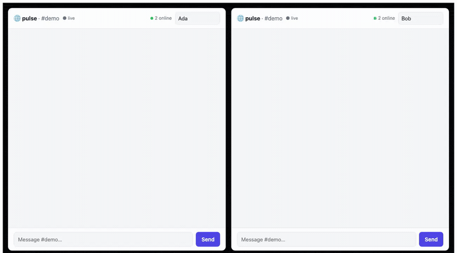

# pulse — a realtime chat room, composed from capability contracts

A live **chat room**: post a message and it appears in every open window
*instantly*, over a held-open **Server-Sent Events** stream. Chosen because it's
the one *class* none of the other showcases touch — every app so far is
request/response; this one is a **sustained connection with server push**.



## Why this is a new class (and how it works on wasip2)

The native host (`host/`) spawns the guest's `incoming-handler` as a task and
returns the HTTP response the instant the guest calls `ResponseOutparam::set` —
then streams the body as the guest keeps writing. So a component *can* set the
response early and then **loop forever writing `data:` frames** while hyper
streams them to the browser. That's real SSE server-push on wasip2 — no
WebSocket, no wasip3 async needed. The guest sleeps between polls with
`wasi:clocks/monotonic-clock` (`subscribe-duration(…).block()`) so it doesn't
busy-spin, and a failed write means the client hung up → the loop ends.

## Product surface (one component, anonymous)

```
POST /rooms/{room}/messages   {user, text}          post a message
GET  /rooms/{room}/messages   ?after=seq            history / catch-up (JSON)
GET  /rooms/{room}/events     ?after=seq            LIVE SSE stream (text/event-stream)
POST /rooms/{room}/presence   {user}                heartbeat "I'm here"       (rung 3)
GET  /rooms/{room}/presence                         who's online               (rung 3)
GET  /                                              usage
```

## Domain model (`records:store`)

- **message** — `{room, user, text, seq, at}`, indexed by `room`. `seq` is a
  global monotonic counter (the SSE/poll **cursor**): a client tails everything
  with `seq > after`.
- **presence** — `{room, user, at}` (rung 3), a short-TTL "last seen" per user.

## Component map

**Reused as-is (3):** `record-store` (the durable message log + cursor),
`event-bus` (publish `room:{room}` on every message — the fan-out spine for
other consumers: notifications, moderation, webhooks), `id-generate` (message
ids). Plus host WASI: `wasi:clocks/{wall-clock,monotonic-clock}` (timestamps +
the SSE sleep) and `wasi:io` (the response stream + sleep pollable).

**New (1):** `pulse-domain` — `pulse:app` exports `wasi:http`. The chat + the
SSE loop.

**Not used:** `auth-guard` (anonymous room; `user` is just a name). Presence uses
a TTL record, not `session-store`, to stay dependency-light.

## Build order (each rung is demoable)

1. ✅ **Post + history** — `POST /messages`, `GET /messages?after=` (records seq
   + event-bus publish). `just e2e-pulse` round-trips.
2. ✅ **Live SSE** — `GET /events` holds the connection open and pushes each new
   message as a `data:` frame. e2e: a reader thread sees a message posted by a
   *separate* request, live. The headline — real server-push on wasip2.
3. ✅ **Presence + browser UI** — heartbeat presence + a chat SPA (served via
   `--static-dir`, native `EventSource`); `just host-pulse`, open two windows.
4. ✅ **Bench** — the new dimension: **one broadcast → 150/150 concurrent
   held-open SSE connections**. See [`bench/PULSE-BENCH.md`](../../bench/PULSE-BENCH.md).

All routes are under `/api/…` so the host's static-dir SPA fallback (index.html
for unknown GETs) doesn't shadow `GET /api/rooms/{room}/events`.

## Non-goals (v1)

WebSocket (wasip2 has no upgrade path — SSE is the streaming primitive here),
auth/moderation, message edit/delete, and horizontal fan-out across hosts (one
host holds the connections; `event-bus` + `event-pusher` are the multi-host
upgrade).
