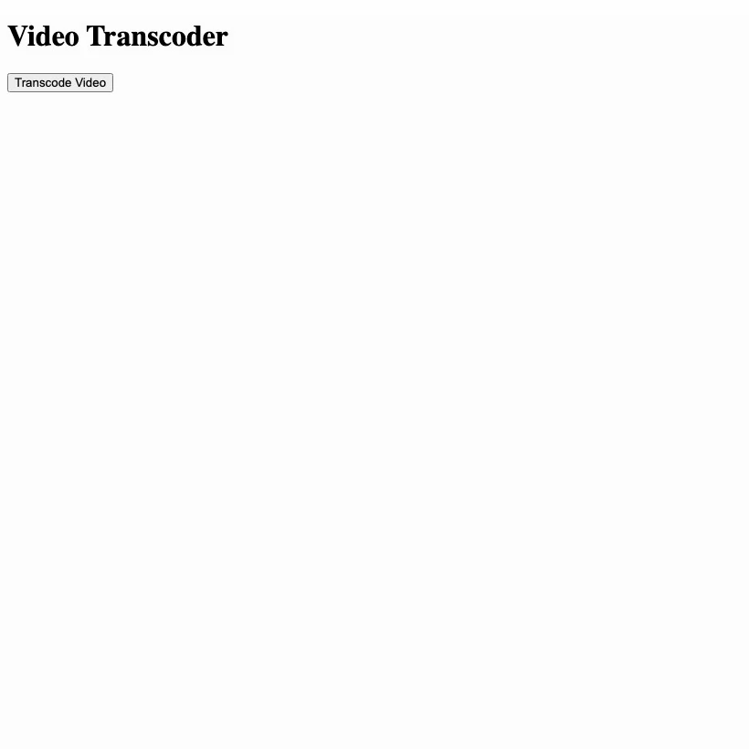

# Video Transcoder

This is a showcase application that fronts the `video-ffmpeg` capability over HTTP
(`components/video-transcoder-domain`). It bridges the WebAssembly sandbox to the host
environment natively.

